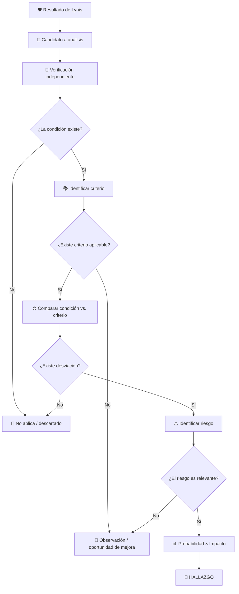

# 🔐 Trabajo Grupal: Auditoría de Seguridad y Hardening de Rocky Linux con Lynis

## Auditoría de Sistemas de Información

---

# 1. Descripción del trabajo

En este trabajo se realizará una **auditoría técnica de seguridad sobre un servidor Rocky Linux**, utilizando **Lynis** como herramienta de apoyo para identificar condiciones que requieran análisis adicional.

La Máquina Virtual (MV) con **Rocky Linux será proporcionada por el docente** y constituirá el entorno oficial sobre el cual deberá desarrollarse el trabajo.

> ⚠️ **No se deberá actualizar, modificar, aplicar hardening ni instalar componentes adicionales antes de obtener la auditoría inicial T0.**

El propósito del trabajo **no consiste únicamente en ejecutar Lynis, corregir configuraciones o incrementar el Hardening Index**.

El estudiante deberá asumir el rol de **auditor de sistemas**, transformando los resultados técnicos obtenidos en información útil para la toma de decisiones.

Para los controles asignados se seguirá la siguiente secuencia:

**Resultado Lynis** → **Investigación** → **Evidencia** → **Condición** → **Criterio** → **Desviación** → **Riesgo** → **Clasificación** → **Recomendación**

Posteriormente, todos los grupos realizarán un proceso técnico controlado de **hardening de SSH**, sobre el cual sí se implementarán controles y se evaluará el **riesgo residual**.

Finalmente, se actualizará el sistema operativo y se realizará una nueva auditoría con Lynis para comparar los diferentes estados del servidor.

La secuencia general del trabajo será:

```text
Rocky Linux proporcionado por el docente
                 │
                 ▼
        Auditoría inicial Lynis
                 │
                 ▼
             T0 - Baseline
                 │
                 ├─────────────────────────────────────┐
                 │                                     │
                 ▼                                     ▼
      5 controles asignados                    Análisis de SSH
                 │                                     │
          Investigación                         Riesgo inicial
                 │                                     │
            Evidencia                            Hardening SSH
                 │                                     │
            Condición                            Verificación
                 │                                     │
             Criterio                            Riesgo residual
                 │                                     │
           Desviación                                  ▼
                 │                              Auditoría T1
              Riesgo                                    │
                 │                                      ▼
          Clasificación                         Actualización
                 │                                      │
         Recomendación                                  ▼
                                                Auditoría T2
                                                       │
                                                       ▼
                                            Comparación T0/T1/T2
                                                       │
                                                       ▼
                                                  Conclusiones
```

---

# 2. Objetivos de aprendizaje

Al finalizar el trabajo, el estudiante estará en capacidad de:

* Ejecutar una auditoría técnica de seguridad sobre Rocky Linux mediante Lynis.
* Interpretar críticamente los resultados obtenidos.
* Diferenciar entre una **sugerencia técnica, una debilidad, una vulnerabilidad, un riesgo y un hallazgo de auditoría**.
* Verificar independientemente las condiciones identificadas por una herramienta automatizada.
* Diferenciar claramente entre **condición, criterio, desviación y riesgo**.
* Utilizar documentación oficial, benchmarks y estándares como criterios de auditoría.
* Determinar si una condición corresponde a un:

  * **Hallazgo**.
  * **Observación / oportunidad de mejora**.
  * **No aplica / descartado**.
* Evaluar riesgos mediante probabilidad e impacto.
* Comunicar condiciones técnicas utilizando lenguaje comprensible para niveles gerenciales.
* Relacionar las condiciones identificadas con ISO/IEC 27001:2022, ISO/IEC 27002, CIS Benchmarks u otros estándares pertinentes.
* Ejecutar y verificar un proceso de hardening de OpenSSH.
* Evaluar el riesgo inicial y residual asociado a la configuración de SSH.
* Evaluar separadamente el efecto del hardening SSH y de la actualización del sistema.
* Interpretar correctamente el Hardening Index de Lynis.
* Emitir conclusiones sustentadas en evidencia y juicio profesional.

---

# 3. Modalidad del trabajo

El trabajo será desarrollado en **grupos de tres estudiantes**.

Todos los grupos utilizarán una MV Rocky Linux con el mismo estado inicial.

Cada grupo recibirá **cinco controles o sugerencias de Lynis asignados por el docente**.

Las recomendaciones relacionadas con **SSH no formarán parte de estos cinco controles**, debido a que el análisis y hardening de SSH será una actividad común y obligatoria para todos los grupos.

> 🎓 **Nivel académico esperado**
>
> Debido a que cada grupo analizará únicamente **cinco controles**, se espera que el desarrollo de cada uno sea profundo, fundamentado y acorde con el nivel académico de estudiantes de maestría.
>
> No será suficiente:
>
> * copiar la descripción de Lynis;
> * copiar una solución encontrada en Internet;
> * limitarse a presentar comandos;
> * asignar un nivel de riesgo sin justificarlo;
> * indicar un control ISO sin explicar su relación;
> * asumir automáticamente que la sugerencia constituye un hallazgo.
>
> Cada análisis deberá demostrar:
>
> * investigación;
> * evidencia;
> * interpretación;
> * aplicación de criterios;
> * análisis de riesgo;
> * juicio profesional;
> * capacidad de comunicación gerencial.

---

# 4. Escenario de auditoría

Para efectos del trabajo se utilizará el siguiente escenario organizacional:

> La organización **ACME Financial Services** utiliza el servidor `SRV-LNX-02`, basado en Rocky Linux, para soportar servicios internos de TI.
>
> El servidor procesa y almacena información corporativa de carácter confidencial y es administrado remotamente mediante SSH por personal autorizado.
>
> La organización requiere mantener niveles adecuados de confidencialidad, integridad, disponibilidad y trazabilidad.
>
> Los accesos administrativos deben encontrarse debidamente restringidos y las actividades relevantes deben poder ser registradas y posteriormente auditadas.
>
> El equipo de Auditoría de Sistemas ha sido solicitado para evaluar la configuración de seguridad del servidor, identificar exposiciones relevantes y formular recomendaciones para reducir los riesgos encontrados.

Este escenario deberá utilizarse como contexto para:

* analizar la relevancia de cada condición;
* justificar probabilidad;
* justificar impacto;
* determinar el nivel de riesgo;
* formular recomendaciones;
* analizar el riesgo asociado a SSH.

> **Importante:** la criticidad de una condición depende del contexto. Una misma configuración podría representar niveles de riesgo diferentes en servidores con funciones distintas.

---

# 5. Reglas del laboratorio

Antes de iniciar:

1. Utilizar exclusivamente la MV proporcionada por el docente.
2. No actualizar Rocky Linux antes de obtener la auditoría inicial T0.
3. No aplicar hardening antes de T0.
4. No modificar archivos de configuración antes de T0.
5. No instalar o eliminar paquetes antes de T0.
6. Mantener evidencia de las actividades realizadas.
7. Analizar exclusivamente los cinco controles asignados por el docente en la sección correspondiente.
8. Realizar adicionalmente el análisis y hardening SSH común para todos los grupos.
9. No asumir que una Suggestion constituye automáticamente una vulnerabilidad.
10. No asumir que una Suggestion constituye automáticamente un hallazgo.
11. Justificar probabilidad e impacto.
12. Documentar todas las fuentes utilizadas.
13. Realizar respaldos antes de modificar configuraciones.
14. Validar SSH antes de recargar o reiniciar el servicio.

> La MV corresponde a un entorno académico controlado y no representa necesariamente una configuración recomendada para un servidor en producción.

---

# 6. Preparación de Lynis

Clonar el repositorio oficial:

```bash
git clone https://github.com/CISOfy/lynis.git
```

Acceder al directorio:

```bash
cd lynis
```

Debido a que el repositorio fue clonado por un usuario sin privilegios, antes de ejecutar Lynis con `sudo` deberá cambiarse la propiedad de sus archivos.

Desde el directorio padre:

```bash
cd ..
sudo chown -R root:root lynis
cd lynis
```

Verificar:

```bash
ls -ld .
```

```bash
ls -l include/functions
```

La finalidad es evitar ejecutar como `root` archivos cuyo contenido pueda ser modificado por un usuario sin privilegios.

---

# 7. Fase 1 — Auditoría inicial T0

Ejecutar:

```bash
sudo ./lynis audit system
```

Esta ejecución constituye:

> **T0 — Baseline o estado inicial de seguridad del servidor.**

Registrar como mínimo:

| Indicador       | T0 |
| --------------- | -: |
| Hardening Index |    |
| Tests performed |    |
| Warnings        |    |
| Suggestions     |    |

Conservar adicionalmente:

```text
/var/log/lynis.log
```

```text
/var/log/lynis-report.dat
```

y la salida completa de la auditoría.

> ⚠️ T0 debe obtenerse **antes de cualquier cambio**, ya que servirá como referencia para las comparaciones posteriores.

---

# 8. Principio fundamental del trabajo

No deberá utilizarse la siguiente interpretación:

```text
Suggestion = Vulnerabilidad = Hallazgo
```

Una recomendación de Lynis constituye inicialmente:

> **Un candidato para investigación.**

La metodología correcta será:

**Suggestion** → **Investigación** → **Evidencia** → **Condición** → **Criterio** → **Desviación** → **Riesgo** → **Clasificación**

Como resultado del análisis, la condición podrá clasificarse como:

1. **Hallazgo**
2. **Observación / oportunidad de mejora**
3. **No aplica / descartado**

La herramienta proporciona información técnica.

El auditor determina:

* si la condición existe;
* si existe un criterio aplicable;
* si existe una desviación;
* qué riesgo genera;
* qué importancia tiene;
* cómo debería comunicarse;
* qué recomendación corresponde.

---

# 9. Análisis de los cinco controles asignados

Cada grupo recibirá **cinco controles o sugerencias Lynis**.

Para cada uno deberá desarrollarse completamente la siguiente metodología.

> ⚠️ **Los cinco controles no deberán ser necesariamente remediados.**
>
> En esta fase el estudiante desempeña principalmente el rol de **auditor**:
>
> **investiga → verifica → evalúa → clasifica → recomienda**.
>
> Por esta razón, **no se calculará riesgo residual para estos cinco controles**.
>
> El riesgo residual será evaluado exclusivamente en la sección correspondiente al hardening de SSH, debido a que allí sí se implementará y verificará un tratamiento.

---

## 9.1 Identificación

Registrar:

```text
ID Lynis:
Categoría de seguridad:
Descripción de la sugerencia:
```

### Ejemplo

```text
ID Lynis: FIRE-4590
Categoría de seguridad: Seguridad de red
Descripción: Configure a firewall/packet filter to filter incoming and outgoing traffic
```

La categoría representa el **dominio de seguridad** al que pertenece la condición y no su criticidad.

Las categorías sugeridas se encuentran en el **Apéndice B**.

---

## 9.2 Interpretación de la sugerencia

Explicar con palabras propias:

* qué componente está evaluando Lynis;
* qué condición parece haber detectado;
* cuál es el propósito de seguridad del control;
* por qué podría ser relevante para el escenario organizacional.

No copiar únicamente la descripción generada por Lynis.

El estudiante deberá demostrar que comprende:

> **qué está evaluando la herramienta y por qué importa.**

---

## 9.3 Verificación independiente

El siguiente paso consiste en determinar si la condición reportada por Lynis **existe realmente**.

La evidencia puede obtenerse mediante:

* comandos;
* archivos de configuración;
* parámetros del kernel;
* estado de servicios;
* permisos;
* paquetes instalados;
* logs;
* configuraciones efectivas;
* archivos del sistema.

Ejemplo:

```bash
<comando utilizado>
```

Además de incluir la salida relevante, deberá explicarse:

> **¿Qué demuestra exactamente esta evidencia?**

Una captura de Lynis por sí sola no será considerada evidencia suficiente cuando la condición pueda verificarse de forma independiente.

### Resultado posible

Si la condición **no puede confirmarse**, deberá analizarse si corresponde clasificarla como:

> **No aplica / descartado**

---

## 9.4 Condición

La **condición** describe:

> **Lo que realmente existe en el sistema auditado.**

Debe redactarse de manera objetiva, sin incluir todavía la recomendación.

### Ejemplo

> El servicio `firewalld` se encuentra deshabilitado y el servidor dispone de servicios escuchando interfaces de red.

No confundir:

* condición;
* riesgo;
* recomendación.

---

## 9.5 Determinación del criterio

El **criterio** representa:

> **Cómo debería encontrarse el componente evaluado según una referencia aplicable.**

La pregunta fundamental será:

> **¿Cómo debería estar configurado este componente y qué fuente sustenta esta afirmación?**

Las fuentes deberán priorizarse de la siguiente manera:

1. Documentación oficial de Rocky Linux.
2. Documentación oficial del componente evaluado.
3. Manuales del sistema.
4. CIS Benchmark correspondiente a Rocky Linux.
5. Documentación oficial de Lynis/CISOfy.
6. ISO/IEC 27001:2022 e ISO/IEC 27002, cuando corresponda.
7. NIST u otros estándares reconocidos.
8. Fuentes técnicas secundarias confiables.

Ejemplos:

```bash
man sshd_config
```

```bash
man login.defs
```

```bash
man auditd
```

No se considerarán como única fuente suficiente:

* Wikipedia;
* blogs sin referencias;
* foros;
* respuestas generadas automáticamente;
* documentos sin autor o procedencia verificable.

---

## 9.6 Desviación

Comparar:

```text
CONDICIÓN ACTUAL
        │
        ▼
      versus
        │
        ▼
CRITERIO ESPERADO
```

Responder:

> **¿Existe una diferencia entre lo encontrado y lo esperado?**

### Si no existe desviación

Probablemente no existe hallazgo.

### Si existe desviación

Continuar con el análisis de riesgo.

---

## 9.7 Identificación del riesgo

Si existe una desviación, responder:

> **¿Qué podría ocurrir si la condición permanece sin tratamiento?**

El riesgo deberá expresarse como un **escenario**.

### Incorrecto

> Riesgo: Firewall deshabilitado.

Eso describe una condición.

### Correcto

> La ausencia de filtrado local podría permitir conexiones hacia servicios innecesariamente expuestos, incrementando la posibilidad de explotación o acceso no autorizado al servidor.

Analizar posibles efectos sobre:

* confidencialidad;
* integridad;
* disponibilidad;
* trazabilidad;
* cumplimiento;
* continuidad;
* operación.

---

## 9.8 Evaluación del riesgo

Se utilizará:

$$
R = P \times I
$$

donde:

* **P = Probabilidad**
* **I = Impacto**
* **R = Nivel de riesgo**

### Probabilidad

| Valor | Nivel    | Descripción                                                            |
| ----: | -------- | ---------------------------------------------------------------------- |
|     1 | Muy baja | El escenario requiere condiciones altamente improbables.               |
|     2 | Baja     | Puede ocurrir, pero requiere condiciones poco frecuentes.              |
|     3 | Media    | Existen condiciones razonables para que ocurra.                        |
|     4 | Alta     | Existen condiciones favorables y exposición relevante.                 |
|     5 | Muy alta | La exposición es permanente o el escenario resulta altamente probable. |

### Impacto

| Valor | Nivel          | Descripción                                                        |
| ----: | -------------- | ------------------------------------------------------------------ |
|     1 | Insignificante | Consecuencias mínimas para la organización.                        |
|     2 | Menor          | Afectación limitada y fácilmente recuperable.                      |
|     3 | Moderado       | Afectación relevante pero controlable.                             |
|     4 | Mayor          | Afectación significativa al servicio, información o negocio.       |
|     5 | Crítico        | Consecuencias severas sobre servicios, información o cumplimiento. |

### Nivel de riesgo

| Resultado | Nivel   |
| --------: | ------- |
|       1–4 | Bajo    |
|       5–9 | Medio   |
|     10–16 | Alto    |
|     17–25 | Crítico |

Ejemplo:

$$
P = 4
$$

$$
I = 4
$$

$$
R = 4 \times 4 = 16
$$

**Nivel de riesgo: Alto**

> Probabilidad e impacto deberán estar acompañados obligatoriamente por una justificación basada en el escenario.

---

## 9.9 Clasificación del resultado

Después de analizar:

* evidencia;
* condición;
* criterio;
* desviación;
* riesgo;

el grupo deberá clasificar el resultado.

### A. Hallazgo

Existe:

* condición confirmada;
* criterio aplicable;
* desviación;
* riesgo relevante;
* evidencia suficiente.

### B. Observación / oportunidad de mejora

Existe una condición susceptible de fortalecimiento, pero:

* no existe incumplimiento claramente demostrado;
* el criterio no es obligatorio;
* el riesgo es bajo o limitado;
* representa principalmente una oportunidad de optimización.

### C. No aplica / descartado

La recomendación:

* no corresponde al escenario;
* no se confirma mediante evidencia;
* no posee criterio aplicable;
* no representa una desviación;
* no genera un riesgo relevante.

Los criterios detallados se encuentran en el **Apéndice A**.

---

## 9.10 Asociación con estándares

Para cada control deberá identificarse el estándar o referencia que pueda utilizarse como criterio o apoyo al tratamiento.

Podrán utilizarse:

* ISO/IEC 27001:2022;
* ISO/IEC 27002;
* CIS Benchmark;
* NIST;
* documentación oficial;
* otro estándar técnicamente pertinente.

No será suficiente indicar:

```text
ISO 27001 - A.x.x
```

Se deberá explicar:

> **Esta condición se relaciona con el control ______ debido a que...**

Para configuraciones Linux específicas, un CIS Benchmark o la documentación oficial pueden proporcionar criterios técnicos más precisos que un estándar de gestión.

---

## 9.11 Recomendación gerencial

Cuando corresponda un hallazgo u observación, deberá formularse una recomendación comprensible para un lector no especializado.

La recomendación debe explicar:

> **¿Qué debería hacer la organización?**

### Incorrecto

> Ejecutar `firewall-cmd --permanent --add-service=ssh`.

### Correcto

> Implementar controles locales de filtrado que permitan únicamente las comunicaciones requeridas para la operación del servidor, aplicando el principio de mínimo privilegio y realizando revisiones periódicas de las reglas autorizadas.

Los comandos podrán aparecer posteriormente como **posible solución técnica**, pero no deberán sustituir la recomendación gerencial.

---

## 9.12 Posible solución técnica

Indicar una posible forma de tratamiento.

La solución deberá:

* apoyarse en documentación confiable;
* considerar el escenario;
* evitar configuraciones mecánicas;
* explicar las implicaciones del cambio.

> Para los cinco controles asignados, la solución se documentará como **propuesta** y no deberá ser implementada obligatoriamente.

---

## 9.13 Conclusión del análisis

Finalizar cada control con una conclusión breve que responda:

* qué se encontró;
* si constituye hallazgo, observación o no aplica;
* qué nivel de riesgo presenta;
* cuál es la recomendación principal.

---

# 10. Matriz consolidada de los cinco controles

El grupo deberá presentar una matriz resumen:

| ID  | Categoría | Condición | Criterio | Riesgo |  P |  I |  R | Nivel | Clasificación                      |
| --- | --------- | --------- | -------- | ------ | -: | -: | -: | ----- | ---------------------------------- |
| XXX | ...       | ...       | ...      | ...    |    |    |    |       | Hallazgo / Observación / No aplica |
| XXX | ...       | ...       | ...      | ...    |    |    |    |       |                                    |
| XXX | ...       | ...       | ...      | ...    |    |    |    |       |                                    |
| XXX | ...       | ...       | ...      | ...    |    |    |    |       |                                    |
| XXX | ...       | ...       | ...      | ...    |    |    |    |       |                                    |

> La matriz constituye únicamente un resumen. Cada uno de los cinco controles deberá desarrollarse completamente utilizando la metodología de la sección anterior.

---

# 11. Fase 2 — Análisis, hardening y riesgo de SSH

Esta fase será realizada por **todos los grupos**.

SSH se analizará de forma independiente de los cinco controles asignados.

> ⚠️ **SSH es el único componente de este trabajo para el cual se realizará formalmente un análisis de riesgo inicial y riesgo residual**, debido a que su tratamiento será implementado y posteriormente verificado.

La secuencia será:

**Configuración SSH inicial** → **Condiciones identificadas** → **Riesgo inicial** → **Hardening** → **Verificación** → **Riesgo residual**

---

## 11.1 Obtener la configuración efectiva inicial

Ejecutar:

```bash
sudo sshd -T
```

Guardar:

```bash
sudo sshd -T > ssh_baseline.txt
```

La opción `-T` permite consultar la configuración efectiva del servicio, evitando depender únicamente de lo escrito en un archivo de configuración.

---

## 11.2 Identificar las recomendaciones SSH de Lynis

Revisar especialmente las recomendaciones asociadas con:

```text
SSH-7408
```

Entre los parámetros que podrían aparecer se encuentran:

```text
AllowTcpForwarding
AllowAgentForwarding
ClientAliveCountMax
ClientAliveInterval
LogLevel
MaxAuthTries
MaxSessions
PermitRootLogin
TCPKeepAlive
X11Forwarding
```

> No todos estos parámetros necesariamente aparecerán en cada auditoría.

> **No aplicar valores mecánicamente.**
>
> Cada parámetro deberá ser investigado y el valor propuesto deberá justificarse utilizando documentación oficial, CIS Benchmark u otra referencia técnicamente adecuada.

---

## 11.3 Matriz inicial de SSH

Completar:

| Parámetro            | Valor inicial | Estado esperado | Implicación de seguridad | Fuente |
| -------------------- | ------------- | --------------- | ------------------------ | ------ |
| MaxAuthTries         |               |                 |                          |        |
| MaxSessions          |               |                 |                          |        |
| X11Forwarding        |               |                 |                          |        |
| AllowTcpForwarding   |               |                 |                          |        |
| AllowAgentForwarding |               |                 |                          |        |
| ...                  |               |                 |                          |        |

---

## 11.4 Identificación del escenario de riesgo SSH

SSH **no constituye por sí mismo un riesgo**.

El análisis deberá centrarse en las condiciones identificadas.

Responder:

> **¿Qué podría ocurrir debido a una configuración SSH excesivamente permisiva o insuficientemente endurecida?**

Ejemplo de escenario:

> Una configuración insuficientemente endurecida del servicio SSH podría incrementar la exposición del servidor ante intentos de acceso no autorizado o ampliar las capacidades disponibles ante el compromiso de una cuenta administrativa, afectando la confidencialidad, integridad o disponibilidad de la información y servicios.

---

## 11.5 Evaluación del riesgo inicial SSH

Determinar:

### Probabilidad inicial

$$
P_i = ?
$$

Justificar.

La justificación deberá considerar:

* exposición del servicio;
* uso administrativo;
* condiciones identificadas;
* necesidad operacional;
* controles existentes.

### Impacto inicial

$$
I_i = ?
$$

Justificar considerando el escenario organizacional.

Calcular:

$$
R_i = P_i \times I_i
$$

Clasificar utilizando la misma matriz de riesgo definida para los cinco controles.

---

## 11.6 Definición del tratamiento

Determinar qué configuraciones serán modificadas.

Completar:

| Parámetro          | Valor inicial | Valor propuesto | Propósito del cambio | Fuente |
| ------------------ | ------------- | --------------- | -------------------- | ------ |
| MaxSessions        |               |                 |                      |        |
| MaxAuthTries       |               |                 |                      |        |
| X11Forwarding      |               |                 |                      |        |
| AllowTcpForwarding |               |                 |                      |        |
| ...                |               |                 |                      |        |

Cada modificación deberá responder:

> **¿Cómo contribuye este cambio a reducir el escenario de riesgo?**

---

## 11.7 Backup antes del hardening

Antes de realizar cualquier modificación:

```bash
sudo cp /etc/ssh/sshd_config /etc/ssh/sshd_config.bak
```

Revisar también:

```bash
ls -la /etc/ssh/sshd_config.d/
```

Si se modifican archivos adicionales, realizar los respaldos correspondientes.

---

## 11.8 Implementación del hardening

Aplicar únicamente las configuraciones investigadas y justificadas.

No modificar parámetros únicamente porque Lynis los sugiere.

La configuración seleccionada debe considerar:

* función del servidor;
* necesidad operativa;
* mínimo privilegio;
* reducción de superficie de ataque;
* compatibilidad;
* impacto operacional.

---

## 11.9 Validación obligatoria

Antes de recargar o reiniciar SSH:

```bash
sudo sshd -t
```

### Si existen errores

> ❌ **NO reiniciar ni recargar SSH.**

Corregir primero la configuración.

Una vez validada:

```bash
sudo systemctl reload sshd
```

Verificar:

```bash
sudo systemctl status sshd
```

---

## 11.10 Obtener configuración efectiva posterior

Guardar:

```bash
sudo sshd -T > ssh_hardened.txt
```

Comparar:

```bash
diff ssh_baseline.txt ssh_hardened.txt
```

El grupo deberá explicar:

* qué cambió;
* por qué cambió;
* qué objetivo de seguridad persigue cada modificación.

---

## 11.11 Verificación de efectividad

Antes de calcular riesgo residual, deberá demostrarse que los controles fueron implementados correctamente.

La evidencia deberá incluir:

```bash
sudo sshd -t
```

```bash
sudo sshd -T
```

y posteriormente los resultados de Lynis obtenidos en T1.

> El riesgo residual deberá calcularse considerando únicamente controles **realmente implementados y verificados**.

---

## 11.12 Evaluación del riesgo residual SSH

Después del hardening se determinará:

$$
R_r = P_r \times I_r
$$

donde:

* $P_r$ = Probabilidad residual.
* $I_r$ = Impacto residual.
* $R_r$ = Riesgo residual.

### Probabilidad residual

Determinar:

$$
P_r = ?
$$

Responder:

> ¿Por qué los controles implementados hacen que el escenario sea menos probable, igual de probable o más probable?

### Impacto residual

Determinar:

$$
I_r = ?
$$

> La implementación de controles no implica automáticamente una reducción del impacto.

Por ejemplo, si un atacante finalmente consigue comprometer una cuenta administrativa, las consecuencias podrían continuar siendo significativas.

Es perfectamente válido obtener:

$$
I_i = I_r
$$

si existe una justificación adecuada.

---

## 11.13 Comparación del riesgo SSH

Presentar:

| Estado                   | Probabilidad | Impacto | Riesgo | Nivel |
| ------------------------ | -----------: | ------: | -----: | ----- |
| T0 — Antes del hardening |              |         |        |       |
| Posterior al hardening   |              |         |        |       |

Explicar:

* qué condiciones fueron reducidas;
* por qué cambió la probabilidad;
* si cambió o no el impacto;
* qué riesgos permanecen;
* por qué el riesgo residual no es cero.

---

## 11.14 Riesgos que permanecen

Considerar, cuando corresponda:

* compromiso de credenciales;
* utilización indebida de cuentas autorizadas;
* errores administrativos;
* vulnerabilidades futuras;
* exposición del servicio;
* deficiencias de monitoreo;
* configuraciones incorrectas;
* ausencia de controles complementarios.

No copiar esta lista automáticamente.

Seleccionar únicamente los riesgos aplicables al escenario.

---

## 11.15 Conclusión gerencial de SSH

El grupo deberá redactar una conclusión que explique:

1. cuál era el riesgo inicial;
2. qué debilidades fueron identificadas;
3. qué controles fueron implementados;
4. cómo se verificó su efectividad;
5. cómo cambió la probabilidad;
6. cómo cambió el impacto;
7. cuál es el riesgo residual;
8. qué riesgos permanecen.

> La aceptación formal del riesgo residual corresponde a la instancia competente de la organización y no al auditor.

Un ejemplo completo se encuentra en el **Apéndice C**.

---

# 12. Fase 3 — Auditoría T1

Después del hardening SSH y **antes de actualizar Rocky Linux**, ejecutar nuevamente:

```bash
sudo ./lynis audit system
```

Esta ejecución constituye:

> **T1 — Estado posterior al hardening SSH**

Registrar:

| Indicador       | T0 | T1 | Diferencia |
| --------------- | -: | -: | ---------: |
| Hardening Index |    |    |            |
| Tests performed |    |    |            |
| Warnings        |    |    |            |
| Suggestions     |    |    |            |

Calcular:

$$
\Delta HI_{SSH}=HI_{T1}-HI_{T0}
$$

Analizar:

* qué recomendaciones SSH desaparecieron;
* cuáles permanecieron;
* cómo cambió el Hardening Index;
* si los resultados son coherentes con las configuraciones implementadas.

---

# 13. Fase 4 — Actualización del sistema

Una vez obtenida T1, revisar actualizaciones:

```bash
sudo dnf check-update
```

Conservar evidencia del resultado.

Posteriormente ejecutar:

```bash
sudo dnf upgrade
```

Documentar:

* cantidad de paquetes actualizados;
* componentes relevantes;
* actualizaciones relacionadas con seguridad cuando puedan identificarse;
* necesidad de reinicio;
* cambios relevantes observados.

Si corresponde:

```bash
sudo reboot
```

> La actualización se realiza **después de T1** para poder separar su efecto del producido por el hardening SSH.

---

# 14. Verificación posterior a la actualización

Después del reinicio, registrar:

```bash
cat /etc/rocky-release
```

```bash
uname -r
```

```bash
sudo dnf check-update
```

Documentar:

* versión del sistema;
* kernel;
* existencia o no de actualizaciones adicionales;
* estado operacional del servidor.

---

# 15. Fase 5 — Auditoría T2

Ejecutar nuevamente Lynis:

```bash
sudo ./lynis audit system
```

Esta ejecución constituye:

> **T2 — Estado posterior a la actualización**

Registrar:

| Indicador       | T0 Baseline | T1 SSH | T2 Actualizado |
| --------------- | ----------: | -----: | -------------: |
| Hardening Index |             |        |                |
| Tests performed |             |        |                |
| Warnings        |             |        |                |
| Suggestions     |             |        |                |

---

# 16. Comparación T0 / T1 / T2

El objetivo es distinguir el efecto de cada intervención.

## 16.1 Efecto del hardening SSH

$$
\Delta HI_{SSH}=HI_{T1}-HI_{T0}
$$

---

## 16.2 Efecto de la actualización

$$
\Delta HI_{Update}=HI_{T2}-HI_{T1}
$$

---

## 16.3 Variación total

$$
\Delta HI_{Total}=HI_{T2}-HI_{T0}
$$

---

## 16.4 Mejora relativa

$$
\text{Mejora relativa}=
\frac{HI_{T2}-HI_{T0}}{HI_{T0}}
\times100
$$

Presentar adicionalmente:

| Métrica         | T0 | T1 | T2 | Interpretación |
| --------------- | -: | -: | -: | -------------- |
| Hardening Index |    |    |    |                |
| Warnings        |    |    |    |                |
| Suggestions     |    |    |    |                |
| SSH Suggestions |    |    |    |                |

---

# 17. Interpretación del Hardening Index

No concluir:

> El servidor obtuvo un Hardening Index de 80, por tanto está 80 % seguro.

Tampoco:

> El servidor ahora es seguro porque aumentó el Hardening Index.

La interpretación correcta será:

> El Hardening Index permite comparar el grado de hardening detectado por Lynis entre diferentes estados del mismo servidor.

Por tanto:

$$
\Delta HI > 0
\not\Rightarrow
\text{Sistema completamente seguro}
$$

El Hardening Index constituye un **indicador técnico comparativo**, no una certificación de seguridad.

---

# 18. Actualización vs. hardening

El grupo deberá demostrar que comprende:

```text
Actualización ≠ Hardening
```

## Actualización

Busca, entre otros objetivos:

* corregir vulnerabilidades conocidas;
* incorporar correcciones;
* mantener versiones soportadas;
* mejorar estabilidad;
* mantener componentes vigentes.

## Hardening

Busca:

* reducir superficie de ataque;
* eliminar funcionalidades innecesarias;
* restringir configuraciones permisivas;
* fortalecer controles;
* acercar el sistema a un baseline de seguridad.

Ambas actividades son:

> **Complementarias, no equivalentes.**

---

# 19. Estructura del informe final

El documento entregable deberá contener:

## 1. Portada

* Institución.
* Asignatura.
* Nombre del trabajo.
* Integrantes.
* Fecha.

## 2. Resumen ejecutivo

Máximo una página.

Debe permitir que un lector gerencial comprenda:

* qué se auditó;
* principales resultados;
* riesgos relevantes;
* acciones realizadas;
* resultado general.

## 3. Objetivo y alcance

## 4. Escenario organizacional

## 5. Metodología de auditoría

## 6. Auditoría inicial T0

## 7. Matriz de los cinco controles asignados

## 8. Desarrollo individual de los cinco controles

## 9. Análisis y hardening SSH

Esta sección deberá incluir:

* baseline SSH;
* condiciones identificadas;
* análisis de riesgo inicial;
* configuraciones propuestas;
* tratamiento;
* evidencia de implementación;
* verificación;
* análisis de riesgo residual;
* conclusión gerencial.

## 10. Auditoría T1

## 11. Actualización del sistema

## 12. Auditoría T2

## 13. Comparación T0 / T1 / T2

## 14. Conclusiones generales

## 15. Referencias

## 16. Anexos técnicos

> **El análisis de riesgo residual no se presenta como una sección independiente del informe**, debido a que forma parte integral del análisis y hardening de SSH.

---

# 20. Ejemplo del formato esperado para uno de los cinco controles

> ⚠️ Este ejemplo tiene fines didácticos. Los estudiantes deberán desarrollar sus propios análisis sobre los cinco controles asignados.

## H-01 — Ausencia de firewall local activo

### 1. Identificación

```text
ID Lynis: FIRE-4590
Categoría: Seguridad de red
```

---

### 2. Resultado de Lynis

```text
Configure a firewall/packet filter to filter incoming and outgoing traffic
[FIRE-4590]
```

---

### 3. Interpretación

Lynis identificó que el servidor no dispone de un mecanismo local activo de filtrado de tráfico que permita restringir explícitamente las comunicaciones de red.

La ausencia de firewall local no significa automáticamente que el servidor se encuentre comprometido. Debe verificarse qué servicios están expuestos y si existen otros mecanismos de filtrado.

---

### 4. Evidencia independiente

Ejecutar:

```bash
sudo firewall-cmd --state
```

```bash
sudo firewall-cmd --list-all
```

```bash
sudo ss -tulpn
```

Ejemplo de resultado:

```text
Firewall local no activo.
Existen servicios escuchando interfaces de red.
```

La evidencia confirma la condición identificada.

---

### 5. Condición

> El servidor no dispone de un firewall local activo que restrinja las comunicaciones según los servicios autorizados.

---

### 6. Criterio

El servidor debería disponer de controles de filtrado que permitan únicamente las comunicaciones requeridas para su función, aplicando mínimo privilegio y reducción de superficie de ataque.

Como referencias pueden utilizarse:

* documentación oficial de Rocky Linux;
* CIS Benchmark;
* políticas organizacionales;
* controles de seguridad de red aplicables.

---

### 7. Desviación

```text
Condición:
Firewall local no activo

Criterio:
Debe existir filtrado adecuado de las comunicaciones

Resultado:
Existe desviación
```

---

### 8. Riesgo

> La ausencia de filtrado local podría permitir conexiones hacia servicios innecesariamente expuestos, incrementando la posibilidad de explotación o acceso no autorizado.

---

### 9. Probabilidad

**4 — Alta**

**Justificación:**

El servidor se encuentra conectado a una red corporativa y posee servicios de red activos. La ausencia de filtrado local incrementa la posibilidad de conexiones desde orígenes que no requieren utilizar dichos servicios.

---

### 10. Impacto

**4 — Mayor**

**Justificación:**

La explotación de un servicio expuesto podría permitir acceso no autorizado, modificación de información o afectación de servicios corporativos.

---

### 11. Evaluación

$$
R=4\times4=16
$$

**Nivel: Alto**

---

### 12. Clasificación

**Hallazgo**

**Justificación:**

La condición:

* fue confirmada;
* posee criterio aplicable;
* presenta desviación;
* genera riesgo relevante;
* dispone de evidencia suficiente.

---

### 13. Asociación con estándares

La condición puede relacionarse con controles asociados con seguridad de redes y protección frente a comunicaciones no autorizadas.

El grupo deberá indicar y justificar específicamente el control o benchmark aplicable.

---

### 14. Recomendación gerencial

> Se recomienda implementar controles locales de filtrado que permitan únicamente las comunicaciones necesarias para la operación del servidor, aplicando el principio de mínimo privilegio y revisando periódicamente las reglas autorizadas.

---

### 15. Posible solución técnica

Una posible alternativa consiste en utilizar `firewalld`.

Por ejemplo:

```bash
sudo systemctl enable --now firewalld
```

Verificar:

```bash
sudo firewall-cmd --state
```

```bash
sudo firewall-cmd --list-all
```

> La configuración exacta deberá depender de los servicios requeridos por el servidor.

---

### 16. Conclusión gerencial

> La ausencia de filtrado local incrementa la exposición del servidor frente a conexiones innecesarias. Considerando que procesa información corporativa confidencial, la condición representa un riesgo Alto y requiere tratamiento prioritario.

---

# 21. Ejemplo de matriz correspondiente

| ID        | Categoría        | Condición               | Criterio                    | Riesgo                              |  P |  I |  R | Nivel | Clasificación |
| --------- | ---------------- | ----------------------- | --------------------------- | ----------------------------------- | -: | -: | -: | ----- | ------------- |
| FIRE-4590 | Seguridad de red | Firewall local inactivo | CIS / política de seguridad | Exposición innecesaria de servicios |  4 |  4 | 16 | Alto  | **Hallazgo**  |
| XXX       | ...              | ...                     | ...                         | ...                                 |    |    |    |       |               |
| XXX       | ...              | ...                     | ...                         | ...                                 |    |    |    |       |               |
| XXX       | ...              | ...                     | ...                         | ...                                 |    |    |    |       |               |
| XXX       | ...              | ...                     | ...                         | ...                                 |    |    |    |       |               |

---

# 22. Conclusiones generales del informe

Las conclusiones deberán derivarse de la evidencia obtenida.

No utilizar:

> La práctica fue interesante y nos permitió aprender Linux.

Utilizar conclusiones orientadas a auditoría:

> La evaluación evidenció que las recomendaciones identificadas automáticamente por Lynis requieren verificación e interpretación antes de ser consideradas hallazgos. La aplicación de criterios y el análisis de riesgo permitieron diferenciar desviaciones relevantes de oportunidades de mejora y condiciones no aplicables.

Las conclusiones deberán abordar:

* estado inicial del servidor;
* principales riesgos;
* controles clasificados como hallazgos;
* controles clasificados como observaciones;
* controles descartados;
* efecto del hardening SSH;
* riesgo residual de SSH;
* efecto de la actualización;
* evolución del Hardening Index;
* limitaciones de Lynis;
* importancia del juicio profesional.

---

# 23. Fuentes recomendadas

## Rocky Linux Documentation

```text
https://docs.rockylinux.org/
```

## Lynis

```text
https://cisofy.com/lynis/
```

## Lynis Controls

```text
https://cisofy.com/lynis/controls/
```

## CIS Benchmarks

```text
https://www.cisecurity.org/cis-benchmarks
```

## CIS Rocky Linux Benchmark

```text
https://www.cisecurity.org/benchmark/rocky_linux
```

## OpenSSH

```text
https://www.openssh.com/
```

## OpenSSH Manual

```text
https://man.openbsd.org/sshd_config
```

## ISO/IEC 27001 e ISO/IEC 27002

Utilizar las versiones y referencias indicadas por el docente.

---

# 24. Criterios de calidad académica

El trabajo deberá demostrar:

### Evidencia

Las afirmaciones se encuentran sustentadas mediante evidencia obtenida del servidor.

### Criterio

Las conclusiones son comparadas con referencias pertinentes.

### Profundidad

Cada uno de los cinco controles es investigado suficientemente.

### Análisis

El estudiante no se limita a describir qué encontró Lynis.

### Juicio profesional

Se determina razonadamente si cada condición constituye:

* hallazgo;
* observación;
* no aplica.

### Riesgo

Probabilidad e impacto están justificados.

### Comunicación

Se diferencia claramente entre lenguaje técnico y gerencial.

### Trazabilidad

Debe poder seguirse:

**Resultado Lynis** → **Evidencia** → **Condición** → **Criterio** → **Desviación** → **Riesgo** → **Clasificación** → **Recomendación**

### Fuentes

Las recomendaciones están respaldadas por fuentes reconocidas.

### Reproducibilidad

Otro auditor debería poder repetir las verificaciones realizadas.

---

# 25. Errores que deben evitarse

❌ Considerar todas las Suggestions como vulnerabilidades.

❌ Considerar todas las Suggestions como hallazgos.

❌ Asignar criticidad directamente según el estado mostrado por Lynis.

❌ Confundir condición con riesgo.

❌ Confundir criterio con recomendación.

❌ Copiar literalmente la explicación de Lynis.

❌ Utilizar únicamente Lynis como evidencia.

❌ Asignar probabilidad e impacto sin justificar.

❌ Citar un control ISO sin explicar su relación.

❌ Presentar comandos Linux como recomendación gerencial.

❌ Calcular riesgo residual para los cinco controles sin haber implementado tratamiento.

❌ Actualizar Rocky Linux antes de obtener T0 y T1.

❌ Reiniciar o recargar SSH sin validar previamente su configuración.

❌ Aplicar valores SSH automáticamente sin investigar su significado.

❌ Confundir actualización con hardening.

❌ Interpretar el Hardening Index como porcentaje de seguridad.

❌ Asumir que una remediación elimina completamente el riesgo.

---

# 26. Principio central del trabajo

> **Lynis no realiza la auditoría por el auditor.**

La herramienta identifica condiciones.

El auditor:

* verifica;
* interpreta;
* compara;
* evalúa;
* clasifica;
* prioriza;
* recomienda;
* comunica.

Por tanto:

**Herramienta** → **Evidencia** → **Criterio** → **Riesgo** → **Juicio profesional** → **Decisión**

---

# Apéndice A — Criterios para determinar si una condición constituye un hallazgo

## A.1 Regla general

Una condición podrá considerarse un hallazgo cuando existan:

```text
Condición confirmada
        +
Criterio aplicable
        +
Desviación
        +
Riesgo relevante
        +
Evidencia suficiente
```

Conceptualmente:

$$
\text{Hallazgo}=
\text{Condición}
+
\text{Criterio}
+
\text{Desviación}
+
\text{Riesgo}
+
\text{Evidencia}
$$

---

## A.2 ¿La condición existe?

Debe poder demostrarse mediante evidencia.

### Sí

Continuar.

### No

Clasificar como:

> **No aplica / descartado**

---

## A.3 ¿Existe un criterio aplicable?

Debe existir una referencia que permita determinar cómo debería encontrarse el componente.

Puede provenir de:

* política;
* procedimiento;
* contrato;
* legislación;
* estándar;
* benchmark;
* documentación oficial;
* baseline técnico.

### Sí

Continuar.

### No

Podría tratarse de:

> **Observación / oportunidad de mejora**

pero difícilmente de un incumplimiento formal.

---

## A.4 ¿Existe desviación?

Comparar:

```text
Condición observada
        vs.
Criterio esperado
```

### No

No existe hallazgo sustentado.

### Sí

Continuar.

---

## A.5 ¿La desviación genera un riesgo relevante?

Preguntar:

> **¿Qué podría ocurrir si no se corrige?**

Si no puede identificarse una consecuencia razonable, deberá reconsiderarse su clasificación.

---

## A.6 ¿Existe evidencia suficiente?

El auditor deberá poder demostrar:

* qué encontró;
* cómo lo verificó;
* qué criterio utilizó;
* cuál es la desviación;
* qué riesgo existe.

Si no puede sustentarlo:

> **No debería formularse todavía como hallazgo.**

---

## A.7 Árbol de decisión



---

## A.8 Clasificaciones posibles

| Clasificación   | Condición          | Criterio                 | Desviación | Riesgo relevante |
| --------------- | ------------------ | ------------------------ | ---------- | ---------------- |
| **Hallazgo**    | Sí                 | Sí                       | Sí         | Sí               |
| **Observación** | Sí                 | Parcial / no obligatorio | Posible    | Bajo o limitado  |
| **No aplica**   | No / no pertinente | No                       | No         | No               |

---

## A.9 Cinco preguntas de validación

Antes de clasificar una condición como hallazgo, responder:

1. **¿Puedo demostrar técnicamente que la condición existe?**
2. **¿Existe un criterio aplicable que indique cómo debería encontrarse?**
3. **¿Existe una desviación entre la condición actual y el criterio?**
4. **¿La desviación genera un riesgo relevante para el escenario?**
5. **¿Tengo evidencia suficiente para sustentar la conclusión?**

Si las cinco respuestas son afirmativas:

> ✅ **Existe fundamento suficiente para formular un hallazgo.**

Si alguna respuesta es negativa:

> ⚠️ **Debe reconsiderarse la clasificación.**

---

# Apéndice B — Categorías de seguridad

La categoría indica el **dominio de seguridad** al que pertenece el control o condición.

No representa su criticidad.

| Categoría                                  | Ejemplos                                          |
| ------------------------------------------ | ------------------------------------------------- |
| **Gestión de identidades y autenticación** | Contraseñas, PAM, vigencia de cuentas             |
| **Control de acceso**                      | SSH, privilegios, restricciones de acceso         |
| **Seguridad de red**                       | Firewall, protocolos, servicios expuestos         |
| **Registro y trazabilidad**                | auditd, syslog, logging                           |
| **Hardening del sistema**                  | systemd, sysctl, kernel                           |
| **Gestión de vulnerabilidades y parches**  | Paquetes y actualizaciones                        |
| **Integridad de archivos**                 | AIDE, controles de integridad                     |
| **Seguridad del sistema de archivos**      | Permisos, mount options, `/tmp`, `/home`          |
| **Seguridad de dispositivos**              | USB, almacenamiento removible                     |
| **Cumplimiento y aspectos legales**        | Banners y advertencias                            |
| **Protección contra malware**              | Antimalware, rootkits                             |
| **Continuidad y disponibilidad**           | Disponibilidad y servicios esenciales             |
| **Configuración y operación segura**       | Servicios innecesarios, configuraciones generales |

### Ejemplos

```text
AUTH-9286
Categoría: Gestión de identidades y autenticación
```

```text
SSH-7408
Categoría: Control de acceso
```

```text
FIRE-4590
Categoría: Seguridad de red
```

```text
ACCT-9628
Categoría: Registro y trazabilidad
```

```text
BANN-7130
Categoría: Cumplimiento y aspectos legales
```

---

# Apéndice C — Ejemplo de análisis de riesgo SSH

> Este ejemplo es únicamente didáctico. Los valores deberán ser determinados y justificados por cada grupo de acuerdo con la evidencia obtenida.

## C.1 Condiciones identificadas

Supóngase que se observan:

| Parámetro          | Estado inicial | Estado esperado                         |
| ------------------ | -------------- | --------------------------------------- |
| MaxAuthTries       | 6              | Más restrictivo según criterio adoptado |
| MaxSessions        | 10             | Ajustado a necesidad operacional        |
| X11Forwarding      | yes            | Deshabilitado si no es requerido        |
| AllowTcpForwarding | yes            | Restringido si no es requerido          |

---

## C.2 Escenario de riesgo

> Una configuración SSH más permisiva de lo necesario podría incrementar la exposición del servidor ante intentos de acceso no autorizado o ampliar las capacidades disponibles en caso de compromiso de una cuenta administrativa, afectando la confidencialidad, integridad o disponibilidad de la información.

---

## C.3 Probabilidad inicial

**3 — Media**

### Justificación

SSH constituye el mecanismo de administración remota del servidor y permanece activo por necesidad operacional.

Se identificaron configuraciones permisivas que incrementan la superficie disponible a través del servicio.

Sin embargo, la materialización del escenario requiere adicionalmente condiciones como:

* compromiso de credenciales;
* acceso al servicio;
* abuso de una cuenta autorizada;
* explotación de una debilidad.

Por ello no se considera inicialmente una probabilidad Alta o Muy alta.

---

## C.4 Impacto inicial

**4 — Mayor**

### Justificación

El compromiso de una cuenta administrativa mediante SSH podría permitir:

* acceso a información confidencial;
* modificación de configuraciones;
* modificación o eliminación de información;
* afectación de servicios.

---

## C.5 Riesgo inicial

$$
R_i=3\times4=12
$$

**Riesgo inicial: Alto**

---

## C.6 Tratamiento

Supóngase que después de investigar los parámetros se implementan controles para:

* reducir intentos de autenticación;
* limitar sesiones simultáneas;
* deshabilitar funcionalidades innecesarias;
* restringir mecanismos de forwarding que no son requeridos.

Cada configuración debe ser documentada y verificada.

---

## C.7 Verificación

Ejecutar:

```bash
sudo sshd -t
```

Consultar:

```bash
sudo sshd -T
```

Comparar:

```bash
diff ssh_baseline.txt ssh_hardened.txt
```

Posteriormente utilizar T1 para comprobar los resultados observados por Lynis.

---

## C.8 Probabilidad residual

**2 — Baja**

### Justificación

Las configuraciones innecesariamente permisivas fueron restringidas y se redujo la superficie disponible a través del servicio.

Sin embargo, SSH continúa siendo necesario y permanecen escenarios relacionados con:

* compromiso de credenciales;
* errores administrativos;
* vulnerabilidades futuras;
* utilización indebida de cuentas legítimas.

---

## C.9 Impacto residual

**4 — Mayor**

### Justificación

El hardening reduce principalmente la probabilidad de materialización.

Sin embargo, si un atacante consigue finalmente comprometer una cuenta administrativa, las consecuencias potenciales para el servidor continúan siendo significativas.

Por tanto:

$$
I_i=I_r=4
$$

---

## C.10 Riesgo residual

$$
R_r=2\times4=8
$$

**Riesgo residual: Medio**

---

## C.11 Comparación

| Estado                | Probabilidad | Impacto | Riesgo | Nivel |
| --------------------- | -----------: | ------: | -----: | ----- |
| Antes del hardening   |            3 |       4 |     12 | Alto  |
| Después del hardening |            2 |       4 |      8 | Medio |

Conceptualmente:

**Riesgo Alto (12)** → **Hardening SSH** → **Riesgo Medio (8)**

---

## C.12 Conclusión gerencial

> La evaluación inicial determinó un riesgo Alto asociado con una configuración de SSH más permisiva de lo requerido para la administración del servidor.
>
> La implementación y posterior verificación de medidas de hardening permitió restringir funcionalidades innecesarias y reducir la exposición asociada al servicio.
>
> Como resultado, la probabilidad estimada se redujo de Media a Baja. El impacto permanece como Mayor debido a que un eventual compromiso exitoso de una cuenta administrativa todavía podría generar consecuencias significativas sobre la confidencialidad, integridad y disponibilidad del servidor.
>
> El riesgo residual se establece en nivel Medio. Aunque el tratamiento implementado redujo la exposición, el riesgo no ha sido eliminado debido a que SSH continúa siendo necesario para la administración remota y permanecen escenarios asociados con credenciales comprometidas, errores administrativos y vulnerabilidades futuras.
>
> Corresponde al propietario del riesgo y a la instancia competente determinar su aceptación o la necesidad de tratamientos adicionales.

---

## Principio final

> **Una Suggestion de Lynis constituye el inicio de la investigación, no la conclusión de la auditoría.**

El valor profesional del auditor consiste en determinar:

> **qué significa la evidencia, cuál es su relevancia para la organización, qué riesgo representa y qué decisión debería tomarse frente a ese riesgo.**


