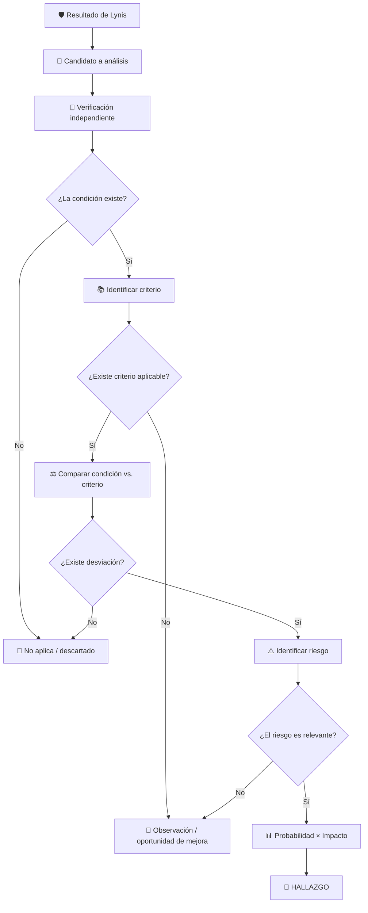

# 🔐 Trabajo Grupal: Auditoría de Seguridad y Hardening de Rocky Linux con Lynis

## Auditoría de Sistemas de Información

---

# 1. Descripción del trabajo

En este trabajo se realizará una **auditoría técnica de seguridad sobre un servidor Rocky Linux**, utilizando **Lynis** como herramienta de apoyo para la identificación de condiciones que requieran análisis adicional.

La Máquina Virtual (MV) con **Rocky Linux será proporcionada por el docente** y constituirá el entorno oficial sobre el cual deberá desarrollarse el trabajo.

> ⚠️ **No se deberá actualizar, modificar, aplicar hardening ni instalar componentes adicionales antes de obtener la auditoría inicial.**

El objetivo del trabajo **no consiste únicamente en ejecutar Lynis, corregir configuraciones o incrementar el Hardening Index**.

El estudiante deberá asumir el rol de **auditor de sistemas**, transformando los resultados técnicos obtenidos en información útil para la toma de decisiones:

**Resultado Lynis** → **Investigación** → **Evidencia** → **Criterio** → **Desviación** → **Riesgo** → **Conclusión del auditor** → **Recomendación**

Posteriormente se realizará un proceso técnico controlado de **hardening de SSH**, seguido de una actualización del sistema, con el propósito de analizar cómo estas acciones modifican el estado de seguridad observado por Lynis.

---

# 2. Objetivos de aprendizaje

Al finalizar el trabajo, el estudiante estará en capacidad de:

* Ejecutar una auditoría técnica de seguridad sobre Rocky Linux mediante Lynis.
* Interpretar críticamente los resultados obtenidos.
* Diferenciar entre una **sugerencia técnica, una debilidad, una vulnerabilidad, un riesgo y un hallazgo de auditoría**.
* Verificar de forma independiente las condiciones identificadas por una herramienta automatizada.
* Utilizar documentación oficial, benchmarks y estándares como criterios de auditoría.
* Determinar si una condición corresponde a un **hallazgo, observación/oportunidad de mejora o resultado no aplicable**.
* Evaluar riesgos mediante probabilidad e impacto.
* Comunicar hallazgos técnicos mediante lenguaje comprensible para niveles gerenciales.
* Relacionar condiciones técnicas con controles de ISO/IEC 27001:2022, ISO/IEC 27002, CIS Benchmarks u otros estándares pertinentes.
* Ejecutar y verificar un proceso de hardening de OpenSSH.
* Evaluar separadamente el efecto del hardening SSH y de la actualización del sistema.
* Analizar el riesgo residual posterior al tratamiento.
* Emitir conclusiones sustentadas en evidencia y juicio profesional.

---

# 3. Modalidad del trabajo

El trabajo será desarrollado en **grupos de tres estudiantes**.

Todos los grupos utilizarán una MV Rocky Linux con el mismo estado inicial.

Cada grupo recibirá **cinco controles o sugerencias de Lynis asignados por el docente**.

Las recomendaciones correspondientes a **SSH no formarán parte de estos cinco controles**, debido a que el hardening de SSH será una actividad común para todos los grupos.

> 🎓 **Nivel académico esperado**
>
> Debido a que cada grupo analizará únicamente **cinco controles**, se espera que el desarrollo de cada uno sea profundo, fundamentado y acorde con el nivel de un estudiante de maestría.
>
> No se considerará suficiente describir superficialmente la recomendación de Lynis o copiar información encontrada en Internet.
>
> Cada análisis deberá demostrar:
>
> * investigación;
> * evidencia;
> * capacidad de interpretación;
> * selección y aplicación de criterios;
> * análisis de riesgo;
> * juicio profesional;
> * capacidad de comunicación gerencial.

---

# 4. Escenario de auditoría

Para efectos del trabajo se utilizará el siguiente escenario organizacional:

> La organización **ACME Financial Services** utiliza el servidor `SRV-LNX-02`, basado en Rocky Linux, para soportar servicios internos de TI.
>
> El servidor procesa y almacena información corporativa de carácter confidencial y es administrado remotamente mediante SSH por personal autorizado.
>
> La organización requiere mantener niveles adecuados de confidencialidad, integridad, disponibilidad y trazabilidad.
>
> Los accesos administrativos deben encontrarse debidamente restringidos y las actividades relevantes deben poder ser registradas y posteriormente auditadas.
>
> El equipo de Auditoría de Sistemas ha sido solicitado para evaluar la configuración de seguridad del servidor, identificar exposiciones relevantes y formular recomendaciones para reducir los riesgos encontrados.

Este escenario deberá utilizarse como contexto para la evaluación de probabilidad e impacto.

---

# 5. Reglas del laboratorio

Antes de iniciar:

1. Utilizar exclusivamente la MV proporcionada por el docente.
2. No actualizar el sistema antes de obtener el baseline.
3. No aplicar hardening previo.
4. No modificar archivos de configuración.
5. No instalar o eliminar paquetes antes de la primera auditoría.
6. Mantener evidencia de las actividades realizadas.
7. Utilizar las cinco sugerencias asignadas por el docente.
8. No asumir que una recomendación de Lynis constituye automáticamente una vulnerabilidad.
9. No asumir que una recomendación constituye automáticamente un hallazgo.
10. Documentar todas las fuentes utilizadas.

> La máquina virtual corresponde a un entorno académico controlado y no representa necesariamente una configuración recomendada para producción.

---

# 6. Preparación de Lynis

Clonar el repositorio oficial:

```bash
git clone https://github.com/CISOfy/lynis.git
```

Acceder al directorio:

```bash
cd lynis
```

Cambiar la propiedad del repositorio antes de ejecutar Lynis con privilegios elevados:

```bash
cd ..
sudo chown -R root:root lynis
cd lynis
```

Verificar:

```bash
ls -ld .
ls -l include/functions
```

---

# 7. Fase 1 — Auditoría inicial T0

Ejecutar:

```bash
sudo ./lynis audit system
```

Esta ejecución constituye:

> **T0 — Baseline de seguridad**

Registrar como mínimo:

| Indicador       | T0 |
| --------------- | -: |
| Hardening Index |    |
| Tests performed |    |
| Warnings        |    |
| Suggestions     |    |

Conservar adicionalmente:

```text
/var/log/lynis.log
/var/log/lynis-report.dat
```

y la salida completa de la ejecución.

---

# 8. Principio fundamental del trabajo

No utilizar la siguiente interpretación:

```text
Suggestion = Vulnerabilidad = Hallazgo
```

La metodología correcta será:

**Suggestion** → **Investigación** → **Evidencia** → **Criterio** → **Desviación** → **Riesgo** → **Conclusión**

Una Suggestion constituye inicialmente un:

> **Candidato para investigación.**

Posteriormente el auditor podrá clasificar el resultado como:

1. **Hallazgo**
2. **Observación / oportunidad de mejora**
3. **No aplica / descartado**

---

# 9. Análisis de los cinco controles asignados

Para cada control o sugerencia asignada deberán desarrollarse las siguientes etapas.

---

## 9.1 Identificación

Registrar:

```text
ID Lynis:
Categoría:
Descripción de la sugerencia:
```

---

## 9.2 Interpretación

Explicar con palabras propias:

* qué componente evalúa Lynis;
* qué condición detectó;
* cuál es el propósito del control;
* por qué podría ser relevante para el escenario organizacional.

No copiar únicamente el texto de Lynis.

---

# 10. Verificación independiente

El auditor deberá verificar si la condición reportada existe realmente.

La evidencia podrá obtenerse mediante:

* comandos;
* archivos de configuración;
* permisos;
* paquetes instalados;
* parámetros del kernel;
* estado de servicios;
* logs;
* configuraciones efectivas.

Ejemplo:

```bash
<comando de verificación>
```

Se deberá explicar:

> **¿Qué demuestra exactamente esta evidencia?**

Una captura de pantalla de Lynis no será considerada por sí sola evidencia suficiente cuando la condición pueda verificarse directamente.

---

# 11. Determinación del criterio

Una condición solamente puede evaluarse adecuadamente cuando existe un estado esperado contra el cual compararla.

La pregunta fundamental será:

> **¿Cómo debería encontrarse configurado este componente y qué fuente sustenta esta afirmación?**

La investigación deberá priorizar:

1. Documentación oficial de Rocky Linux.
2. Documentación oficial del componente.
3. Manuales del sistema.
4. CIS Benchmark aplicable.
5. Documentación oficial de Lynis/CISOfy.
6. ISO/IEC 27001:2022 e ISO/IEC 27002, cuando corresponda.
7. NIST u otros estándares reconocidos.
8. Fuentes técnicas secundarias confiables.

Ejemplos:

```bash
man sshd_config
man login.defs
man auditd
```

No se considerarán fuentes suficientes por sí solas:

* Wikipedia;
* blogs sin referencias;
* foros;
* respuestas generadas automáticamente;
* contenido sin autor o procedencia verificable.

---

# 12. Identificación de la desviación

Una vez identificados:

* **Condición actual**
* **Criterio esperado**

comparar:

```text
CONDICIÓN ACTUAL
        vs.
CRITERIO ESPERADO
```

Responder:

> **¿Existe realmente una desviación?**

Si no existe desviación, probablemente no existe hallazgo.

---

# 13. Identificación del riesgo

Si existe una desviación, responder:

> **¿Qué podría ocurrir si la condición permanece sin tratamiento?**

El riesgo deberá expresarse como un escenario y no simplemente como el nombre de la debilidad.

Ejemplo incorrecto:

> Riesgo: firewall deshabilitado.

Ejemplo correcto:

> La ausencia de filtrado local podría permitir conexiones hacia servicios no autorizados, incrementando la posibilidad de explotación o acceso no autorizado al servidor.

Considerar posibles afectaciones sobre:

* confidencialidad;
* integridad;
* disponibilidad;
* trazabilidad;
* cumplimiento;
* continuidad;
* operación.

---

# 14. Evaluación de probabilidad e impacto

Se utilizará:

$$
R = P \times I
$$

donde:

* **P = Probabilidad**
* **I = Impacto**
* **R = Nivel de riesgo**

---

## 14.1 Probabilidad

| Valor | Nivel    | Descripción                                                            |
| ----: | -------- | ---------------------------------------------------------------------- |
|     1 | Muy baja | El escenario requiere condiciones altamente improbables.               |
|     2 | Baja     | Puede ocurrir, pero requiere condiciones poco frecuentes.              |
|     3 | Media    | Existen condiciones razonables para que ocurra.                        |
|     4 | Alta     | Existen condiciones favorables y exposición relevante.                 |
|     5 | Muy alta | La exposición es permanente o el escenario resulta altamente probable. |

---

## 14.2 Impacto

| Valor | Nivel          | Descripción                                                        |
| ----: | -------------- | ------------------------------------------------------------------ |
|     1 | Insignificante | Consecuencias mínimas.                                             |
|     2 | Menor          | Afectación limitada y fácilmente recuperable.                      |
|     3 | Moderado       | Afectación relevante pero controlable.                             |
|     4 | Mayor          | Afectación significativa al servicio, información o negocio.       |
|     5 | Crítico        | Consecuencias severas sobre servicios, información o cumplimiento. |

---

## 14.3 Nivel de riesgo

| Resultado | Nivel   |
| --------: | ------- |
|       1–4 | Bajo    |
|       5–9 | Medio   |
|     10–16 | Alto    |
|     17–25 | Crítico |

Ejemplo:

$$
P = 4
$$

$$
I = 4
$$

$$
R = 4 \times 4 = 16
$$

**Nivel de riesgo: Alto**

> Probabilidad e impacto deberán estar acompañados obligatoriamente por una justificación.

---

# 15. Clasificación del resultado

Después de analizar la evidencia, criterio, desviación y riesgo, cada control deberá clasificarse como:

## Hallazgo

Existe:

* condición confirmada;
* criterio aplicable;
* desviación;
* riesgo relevante;
* evidencia suficiente.

## Observación / oportunidad de mejora

Existe una condición susceptible de fortalecimiento, pero:

* no existe incumplimiento claramente demostrado;
* el riesgo es reducido;
* no existe criterio obligatorio;
* representa principalmente una oportunidad de optimización.

## No aplica / descartado

La recomendación:

* no corresponde al escenario;
* no se confirma mediante evidencia;
* no posee criterio aplicable;
* no representa una desviación;
* no genera un riesgo relevante.

---

# 16. Comunicación gerencial

Cuando el resultado sea clasificado como **hallazgo**, deberá redactarse una explicación gerencial que responda:

### ¿Qué ocurre?

Explicar la condición de forma comprensible.

### ¿Por qué importa?

Relacionarla con el negocio y el riesgo.

### ¿Qué podría ocurrir?

Describir posibles consecuencias.

### ¿Qué debería hacerse?

Proponer una recomendación sin limitarse a comandos Linux.

Ejemplo incorrecto:

> Modificar `/etc/ssh/sshd_config` y configurar `MaxSessions 2`.

Ejemplo gerencial:

> Se recomienda restringir las capacidades del servicio de administración remota al mínimo necesario para la operación, reduciendo configuraciones excesivamente permisivas que podrían incrementar la exposición ante el compromiso de una cuenta administrativa.

---

# 17. Relación con ISO/IEC 27001 u otros estándares

Para cada control analizado deberá identificarse:

> **El control de ISO/IEC 27001:2022, ISO/IEC 27002, CIS Benchmark u otro estándar que pueda utilizarse como criterio o referencia para el tratamiento de la condición.**

La asociación deberá ser justificada.

No será suficiente indicar:

```text
ISO 27001 A.x.x
```

Deberá explicarse:

> Esta condición se relaciona con el control ______ debido a que...

Para configuraciones técnicas específicas, CIS Benchmark o documentación oficial pueden proporcionar criterios más precisos que ISO/IEC 27001.

---

# 18. Matriz consolidada de los cinco controles

Cada grupo deberá presentar inicialmente una matriz:

| ID  | Condición | Evidencia | Criterio | Riesgo |  P |  I |  R | Nivel | Clasificación                      |
| --- | --------- | --------- | -------- | ------ | -: | -: | -: | ----- | ---------------------------------- |
| XXX | ...       | ...       | ...      | ...    |    |    |    |       | Hallazgo / Observación / No aplica |
| XXX | ...       | ...       | ...      | ...    |    |    |    |       |                                    |
| XXX | ...       | ...       | ...      | ...    |    |    |    |       |                                    |
| XXX | ...       | ...       | ...      | ...    |    |    |    |       |                                    |
| XXX | ...       | ...       | ...      | ...    |    |    |    |       |                                    |

La matriz es un resumen.

El desarrollo completo deberá realizarse posteriormente para cada control.

---

# 19. Fase 2 — Hardening completo de SSH

Todos los grupos deberán realizar una evaluación y hardening de OpenSSH.

Esta actividad será común.

---

## 19.1 Obtener configuración inicial

Ejecutar:

```bash
sudo sshd -T
```

Guardar:

```bash
sudo sshd -T > ssh_baseline.txt
```

Identificar las recomendaciones `SSH-7408` generadas por Lynis.

Entre los parámetros que podrían aparecer se encuentran:

```text
AllowTcpForwarding
AllowAgentForwarding
ClientAliveCountMax
ClientAliveInterval
LogLevel
MaxAuthTries
MaxSessions
PermitRootLogin
TCPKeepAlive
X11Forwarding
```

> No aplicar valores mecánicamente. Cada modificación deberá tener una justificación técnica y una fuente.

---

# 20. Matriz de hardening SSH

Completar:

| Parámetro          | Valor inicial | Valor propuesto | Propósito de seguridad | Fuente |
| ------------------ | ------------- | --------------- | ---------------------- | ------ |
| MaxSessions        |               |                 |                        |        |
| MaxAuthTries       |               |                 |                        |        |
| X11Forwarding      |               |                 |                        |        |
| AllowTcpForwarding |               |                 |                        |        |
| ...                |               |                 |                        |        |

---

# 21. Backup

Antes de modificar:

```bash
sudo cp /etc/ssh/sshd_config /etc/ssh/sshd_config.bak
```

Revisar:

```bash
ls -la /etc/ssh/sshd_config.d/
```

---

# 22. Implementación

Aplicar las configuraciones seleccionadas.

Antes de recargar SSH:

```bash
sudo sshd -t
```

Si existen errores:

> ❌ **NO reiniciar ni recargar el servicio.**

Corregir primero la configuración.

Una vez validada:

```bash
sudo systemctl reload sshd
```

Verificar:

```bash
sudo systemctl status sshd
```

Guardar la nueva configuración efectiva:

```bash
sudo sshd -T > ssh_hardened.txt
```

Comparar:

```bash
diff ssh_baseline.txt ssh_hardened.txt
```

---

# 23. Fase 3 — Auditoría T1

Después del hardening SSH y **antes de actualizar Rocky Linux**, ejecutar:

```bash
sudo ./lynis audit system
```

Registrar:

| Indicador       | T0 | T1 | Diferencia |
| --------------- | -: | -: | ---------: |
| Hardening Index |    |    |            |
| Tests performed |    |    |            |
| Warnings        |    |    |            |
| Suggestions     |    |    |            |

Calcular:

$$
\Delta HI_{SSH} = HI_{T1} - HI_{T0}
$$

Analizar:

* qué recomendaciones SSH desaparecieron;
* cuáles permanecieron;
* cómo cambió el Hardening Index;
* qué riesgos permanecen.

---

# 24. Fase 4 — Actualización del sistema

Después de obtener T1:

```bash
sudo dnf check-update
```

Conservar evidencia.

Posteriormente:

```bash
sudo dnf upgrade
```

Documentar:

* cantidad de paquetes actualizados;
* componentes relevantes;
* necesidad de reinicio;
* cambios observados.

Si corresponde, reiniciar:

```bash
sudo reboot
```

---

# 25. Verificación posterior

Después del reinicio:

```bash
cat /etc/rocky-release
```

```bash
uname -r
```

```bash
sudo dnf check-update
```

---

# 26. Fase 5 — Auditoría T2

Ejecutar nuevamente:

```bash
sudo ./lynis audit system
```

Registrar:

| Indicador       | T0 Baseline | T1 SSH | T2 Actualizado |
| --------------- | ----------: | -----: | -------------: |
| Hardening Index |             |        |                |
| Tests performed |             |        |                |
| Warnings        |             |        |                |
| Suggestions     |             |        |                |

---

# 27. Comparación T0 / T1 / T2

### Efecto del hardening SSH

$$
\Delta HI_{SSH} = HI_{T1} - HI_{T0}
$$

### Efecto de la actualización

$$
\Delta HI_{Update} = HI_{T2} - HI_{T1}
$$

### Variación total

$$
\Delta HI_{Total} = HI_{T2} - HI_{T0}
$$

### Mejora relativa

$$
\text{Mejora relativa} =
\frac{HI_{T2}-HI_{T0}}{HI_{T0}}
\times 100
$$

---

# 28. Interpretación del Hardening Index

No concluir:

> El servidor obtuvo 80 puntos, por tanto está 80 % seguro.

Interpretación correcta:

> El Hardening Index permite comparar el grado de hardening detectado por Lynis entre diferentes estados del mismo servidor.

Por tanto:

$$
\Delta HI > 0
\not\Rightarrow
\text{Sistema completamente seguro}
$$

---

# 29. Riesgo residual del hardening SSH

Evaluar el riesgo antes y después del tratamiento.

### Riesgo inicial

$$
R_i = P_i \times I_i
$$

### Riesgo residual

$$
R_r = P_r \times I_r
$$

Presentar:

| Estado   |  P |  I | Riesgo |
| -------- | -: | -: | ------ |
| Inicial  |    |    |        |
| Residual |    |    |        |

Explicar:

> ¿Por qué el riesgo residual no necesariamente llega a cero?

---

# 30. Actualización vs. hardening

El grupo deberá demostrar que comprende la diferencia:

```text
Actualización ≠ Hardening
```

### Actualización

Busca, entre otros objetivos:

* corregir vulnerabilidades conocidas;
* incorporar correcciones;
* mantener versiones soportadas;
* mejorar estabilidad.

### Hardening

Busca:

* reducir superficie de ataque;
* eliminar funcionalidades innecesarias;
* restringir configuraciones permisivas;
* fortalecer controles;
* acercar el sistema a un baseline de seguridad.

Ambas actividades son:

> **Complementarias, no equivalentes.**

---

# 31. Estructura del informe final

## 1. Portada

* Institución
* Asignatura
* Trabajo
* Integrantes
* Fecha

## 2. Resumen ejecutivo

Máximo una página.

Debe permitir que un lector gerencial comprenda:

* qué se auditó;
* principales resultados;
* riesgos relevantes;
* acciones realizadas;
* conclusión general.

## 3. Objetivo y alcance

## 4. Escenario organizacional

## 5. Metodología

## 6. Auditoría inicial T0

## 7. Matriz de los cinco controles asignados

## 8. Desarrollo individual de los cinco controles

## 9. Hardening SSH

## 10. Auditoría T1

## 11. Actualización del sistema

## 12. Auditoría T2

## 13. Comparación T0 / T1 / T2

## 14. Análisis de riesgo residual

## 15. Conclusiones generales

## 16. Referencias

## 17. Anexos técnicos

---

# 32. Ejemplo del formato esperado del entregable

A continuación se presenta un ejemplo completo.

> ⚠️ Este ejemplo tiene únicamente fines didácticos. Los estudiantes deberán realizar su propio análisis sobre los controles asignados.

---

## H-01 — Ausencia de firewall local activo

### 1. Resultado de Lynis

```text
Configure a firewall/packet filter to filter incoming and outgoing traffic
[FIRE-4590]
```

---

### 2. Interpretación de la sugerencia

Lynis identificó que el servidor no dispone de un mecanismo local activo de filtrado de tráfico que permita restringir explícitamente las conexiones de red.

La ausencia de firewall local no significa automáticamente que el servidor se encuentre comprometido, pero requiere verificar cuáles servicios están expuestos y si existen otros mecanismos de filtrado en la infraestructura.

---

### 3. Evidencia independiente

Se ejecutaron:

```bash
sudo firewall-cmd --state
```

```bash
sudo firewall-cmd --list-all
```

```bash
sudo ss -tulpn
```

Resultado observado:

```text
Firewall local no activo.
Existen servicios escuchando interfaces de red.
```

La evidencia confirma la condición identificada por Lynis.

---

### 4. Condición

El servidor no dispone de un firewall local activo que restrinja las conexiones entrantes y salientes según los servicios autorizados.

---

### 5. Criterio

El principio de **mínimo privilegio y reducción de superficie de ataque** establece que únicamente deben permitirse comunicaciones de red necesarias para el funcionamiento del servicio.

Como criterio técnico pueden utilizarse:

* documentación oficial de Rocky Linux;
* CIS Benchmark aplicable;
* políticas corporativas de seguridad;
* controles de seguridad relacionados con protección de redes.

---

### 6. Desviación

El estado actual permite que la exposición de servicios dependa únicamente de su configuración individual o de controles externos, sin existir filtrado local complementario.

Por tanto:

```text
Condición actual ≠ Estado esperado
```

Se confirma una desviación.

---

### 7. Riesgo

La ausencia de filtrado local podría permitir conexiones hacia servicios innecesariamente expuestos, incrementando la superficie de ataque y facilitando intentos de explotación o acceso no autorizado al servidor.

---

### 8. Probabilidad

**4 — Alta**

#### Justificación

El servidor se encuentra conectado a una red corporativa y posee servicios de red activos. La ausencia de filtrado local incrementa la posibilidad de que un servicio quede accesible desde segmentos desde los cuales no debería ser utilizado.

---

### 9. Impacto

**4 — Mayor**

#### Justificación

La explotación de un servicio expuesto podría permitir acceso no autorizado, ejecución de acciones sobre el servidor o compromiso de información corporativa.

Debido a que el servidor procesa información confidencial, el impacto podría afectar principalmente confidencialidad e integridad.

---

### 10. Evaluación del riesgo

$$
R = P \times I
$$

$$
R = 4 \times 4 = 16
$$

**Nivel de riesgo: Alto**

---

### 11. Clasificación

**Hallazgo**

#### Justificación

La condición:

* fue confirmada mediante evidencia;
* posee un criterio aplicable;
* presenta una desviación frente al estado esperado;
* genera un riesgo relevante;
* puede ser sustentada técnicamente.

---

### 12. Asociación con estándares

La condición puede relacionarse con controles asociados a la **seguridad de redes** y a la protección de los sistemas frente a comunicaciones no autorizadas.

La asociación específica deberá justificarse de acuerdo con la versión del estándar utilizada durante el curso.

Como criterio técnico complementario resulta apropiado utilizar el CIS Benchmark correspondiente a Rocky Linux/RHEL.

---

### 13. Recomendación gerencial

> Se recomienda implementar controles locales de filtrado de tráfico que permitan únicamente las comunicaciones necesarias para la operación del servidor, complementando los controles existentes en la infraestructura de red. Las reglas implementadas deberán responder al principio de mínimo privilegio y ser revisadas periódicamente para evitar exposiciones innecesarias.

---

### 14. Posible solución técnica

Una posible alternativa consiste en implementar `firewalld`.

La configuración exacta dependerá de los servicios autorizados.

Por ejemplo, si únicamente fuera necesario permitir administración mediante SSH:

```bash
sudo systemctl enable --now firewalld
```

Verificar:

```bash
sudo firewall-cmd --state
```

Revisar servicios permitidos:

```bash
sudo firewall-cmd --list-all
```

> El auditor recomienda el control. La configuración específica deberá ser definida y aprobada por los responsables de administración de acuerdo con los requerimientos operacionales.

---

### 15. Conclusión gerencial

> La ausencia de filtrado local incrementa innecesariamente la exposición del servidor ante conexiones provenientes de la red corporativa. Considerando que el equipo procesa información confidencial y dispone de servicios accesibles mediante red, la condición representa un riesgo alto y requiere tratamiento prioritario.

---

# 33. Ejemplo de matriz correspondiente

| ID        | Condición               | Evidencia                   | Criterio                           | Riesgo                              |  P |  I |  R | Nivel | Clasificación |
| --------- | ----------------------- | --------------------------- | ---------------------------------- | ----------------------------------- | -: | -: | -: | ----- | ------------- |
| FIRE-4590 | Firewall local inactivo | `firewall-cmd`, `ss -tulpn` | CIS / política de seguridad de red | Exposición innecesaria de servicios |  4 |  4 | 16 | Alto  | **Hallazgo**  |
| XXX       | ...                     | ...                         | ...                                | ...                                 |    |    |    |       |               |
| XXX       | ...                     | ...                         | ...                                | ...                                 |    |    |    |       |               |
| XXX       | ...                     | ...                         | ...                                | ...                                 |    |    |    |       |               |
| XXX       | ...                     | ...                         | ...                                | ...                                 |    |    |    |       |               |

---

# 34. Conclusiones generales del informe

Las conclusiones deberán derivarse de los resultados obtenidos.

No utilizar:

> La práctica fue interesante y nos permitió aprender Linux.

Utilizar conclusiones orientadas a auditoría:

> La evaluación evidenció que varias recomendaciones identificadas automáticamente por Lynis requieren interpretación antes de ser consideradas hallazgos. La validación independiente permitió distinguir condiciones relevantes de simples oportunidades de mejora y asignar prioridades basadas en riesgo.

Las conclusiones deberán abordar:

* estado inicial;
* principales riesgos;
* controles clasificados como hallazgos;
* controles clasificados como observaciones;
* controles descartados;
* efecto del hardening SSH;
* efecto de la actualización;
* evolución del Hardening Index;
* riesgo residual;
* limitaciones de la herramienta;
* importancia del juicio profesional.

---

# 35. Fuentes recomendadas

Priorizar:

### Rocky Linux Documentation

```text
https://docs.rockylinux.org/
```

### Lynis

```text
https://cisofy.com/lynis/
```

### Lynis Controls

```text
https://cisofy.com/lynis/controls/
```

### CIS Benchmarks

```text
https://www.cisecurity.org/cis-benchmarks
```

### OpenSSH

```text
https://www.openssh.com/
```

### ISO/IEC 27001 e ISO/IEC 27002

Utilizar las versiones y referencias indicadas por el docente.

---

# 36. Criterios de calidad académica

El trabajo deberá demostrar:

### Evidencia

Las afirmaciones están sustentadas mediante evidencia obtenida del servidor.

### Criterio

Las conclusiones se comparan contra referencias pertinentes.

### Profundidad

Cada uno de los cinco controles es investigado suficientemente.

### Análisis

No se limita a describir qué encontró Lynis.

### Juicio profesional

Se determina razonadamente si una condición constituye hallazgo.

### Riesgo

Probabilidad e impacto están justificados.

### Comunicación

Se diferencian claramente lenguaje técnico y gerencial.

### Trazabilidad

Debe ser posible seguir:

**Resultado Lynis** → **Evidencia** → **Criterio** → **Riesgo** → **Clasificación** → **Recomendación**

### Fuentes

Las recomendaciones se encuentran respaldadas por fuentes reconocidas.

### Reproducibilidad

Otro auditor debería poder repetir las verificaciones realizadas.

---

# 37. Errores que deben evitarse

❌ Considerar todas las Suggestions como vulnerabilidades.

❌ Considerar todas las Suggestions como hallazgos.

❌ Asignar criticidad según el estado mostrado por Lynis.

❌ Copiar literalmente la explicación de Lynis.

❌ Utilizar únicamente Lynis como evidencia.

❌ Asignar probabilidad e impacto sin justificar.

❌ Citar un control ISO sin explicar la relación.

❌ Presentar comandos Linux como recomendación gerencial.

❌ Actualizar Rocky Linux antes de obtener T0 y T1.

❌ Reiniciar SSH sin validar previamente la configuración.

❌ Confundir actualización con hardening.

❌ Interpretar el Hardening Index como porcentaje de seguridad.

❌ Asumir que una remediación elimina completamente el riesgo.

---

# 38. Principio central del trabajo

> **Lynis no realiza la auditoría por el auditor.**

La herramienta identifica condiciones.

El auditor:

* verifica;
* interpreta;
* compara;
* evalúa;
* prioriza;
* concluye;
* comunica.

Por tanto:

**Herramienta** → **Evidencia** → **Criterio** → **Riesgo** → **Juicio profesional** → **Decisión**

---

# Apéndice A — Criterios para determinar si una condición constituye un hallazgo

## A.1 Regla general

Una condición podrá considerarse un hallazgo cuando existan:

```text
Condición confirmada
        +
Criterio aplicable
        +
Desviación
        +
Riesgo relevante
        +
Evidencia suficiente
```

Conceptualmente:

$$
\text{Hallazgo} =
\text{Condición}
+
\text{Criterio}
+
\text{Desviación}
+
\text{Riesgo}
+
\text{Evidencia}
$$

---

## A.2 Pregunta 1 — ¿La condición existe?

Debe poder demostrarse mediante evidencia.

### Sí

Continuar.

### No

Clasificar como:

> **No aplica / descartado**

---

## A.3 Pregunta 2 — ¿Existe un criterio aplicable?

Debe existir una referencia que permita determinar cómo debería encontrarse el sistema.

Puede provenir de:

* política;
* procedimiento;
* contrato;
* legislación;
* estándar;
* benchmark;
* documentación oficial;
* baseline técnico.

### Sí

Continuar.

### No

La condición podría clasificarse como:

> **Observación / oportunidad de mejora**

pero difícilmente como incumplimiento formal.

---

## A.4 Pregunta 3 — ¿Existe desviación?

Comparar:

```text
Condición observada
        vs.
Criterio esperado
```

### No existe diferencia

No existe hallazgo.

### Existe diferencia

Continuar.

---

## A.5 Pregunta 4 — ¿La desviación genera un riesgo relevante?

Preguntar:

> ¿Qué podría ocurrir si no se corrige?

Si no puede identificarse una consecuencia razonable, se deberá reconsiderar su clasificación.

---

## A.6 Pregunta 5 — ¿Existe evidencia suficiente?

El auditor deberá poder demostrar:

* qué encontró;
* cómo lo verificó;
* qué criterio utilizó;
* cuál es la desviación;
* qué riesgo existe.

Si no puede sustentarlo:

> **No debería formularse todavía como hallazgo.**

---

## A.7 Árbol de decisión



---

## A.8 Clasificaciones posibles

| Clasificación   | Condición          | Criterio                 | Desviación | Riesgo relevante |
| --------------- | ------------------ | ------------------------ | ---------- | ---------------- |
| **Hallazgo**    | Sí                 | Sí                       | Sí         | Sí               |
| **Observación** | Sí                 | Parcial / No obligatorio | Posible    | Bajo o limitado  |
| **No aplica**   | No / No pertinente | No                       | No         | No               |

---

## A.9 Cinco preguntas de validación

Antes de clasificar una condición como hallazgo, responder:

1. **¿Puedo demostrar técnicamente que la condición existe?**
2. **¿Existe un criterio aplicable que indique cómo debería encontrarse?**
3. **¿Existe una desviación entre la condición actual y el criterio?**
4. **¿La desviación genera un riesgo relevante para el escenario?**
5. **¿Tengo evidencia suficiente para sustentar la conclusión?**

Si las cinco respuestas son afirmativas:

> ✅ **Existe fundamento suficiente para formular un hallazgo.**

Si alguna respuesta es negativa:

> ⚠️ **Debe reconsiderarse la clasificación.**

---

## A.10 Principio final

> **Una Suggestion de Lynis constituye el inicio de la investigación, no la conclusión de la auditoría.**

El valor profesional del auditor se encuentra en determinar:

> **qué significa la evidencia, cuál es su relevancia para la organización y qué decisión debería tomarse frente al riesgo identificado.**
