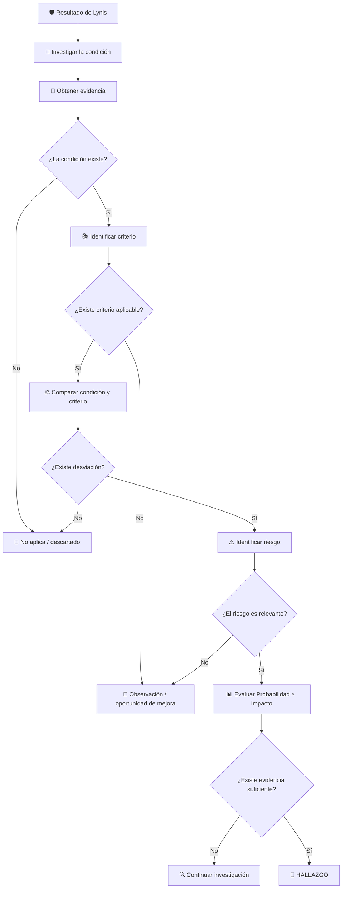

# 📘 Guía de apoyo: Condición, Criterio, Desviación y Evidencia en un Hallazgo de Auditoría

## Auditoría de Sistemas de Información

---

# 1. Propósito

Esta guía tiene como objetivo ayudar al estudiante a determinar de manera estructurada cuándo una condición identificada durante una auditoría técnica puede convertirse en:

* **Hallazgo**
* **Observación / oportunidad de mejora**
* **No aplica / descartado**

El análisis deberá seguir la siguiente lógica:

**Resultado técnico** → **Evidencia** → **Condición** → **Criterio** → **Desviación** → **Riesgo** → **Clasificación**

> Una recomendación generada por una herramienta como Lynis constituye inicialmente un **candidato para investigación**, no un hallazgo automático.

---

# 2. ¿Qué es la condición?

La **condición** describe:

> **Lo que el auditor encontró realmente en el sistema evaluado.**

Representa el **estado actual** del componente, servicio, configuración o control que está siendo auditado.

La condición debe ser:

* objetiva;
* verificable;
* sustentada mediante evidencia;
* redactada sin incluir todavía la recomendación.

## Ejemplo

Lynis muestra:

```text
Configure a firewall/packet filter to filter incoming and outgoing traffic
[FIRE-4590]
```

El auditor verifica:

```bash
sudo firewall-cmd --state
```

y obtiene que el servicio no está activo.

La condición podría redactarse así:

> **El servidor no dispone de un firewall local activo para restringir las comunicaciones de red.**

---

## 2.1 ¿Qué NO es una condición?

Incorrecto:

> El servidor tiene un riesgo alto.

Eso corresponde al **riesgo**.

Incorrecto:

> Se debe instalar firewalld.

Eso corresponde a una **recomendación o posible solución**.

Correcto:

> El servicio `firewalld` no se encuentra activo.

---

# 3. ¿Qué es el criterio?

El **criterio** describe:

> **Cómo debería encontrarse el elemento evaluado según una referencia aplicable.**

El criterio constituye el estado esperado contra el cual se compara la condición encontrada.

Puede provenir de:

* políticas organizacionales;
* procedimientos internos;
* contratos;
* legislación;
* estándares;
* normas;
* CIS Benchmarks;
* documentación oficial del fabricante;
* baselines de hardening;
* requisitos regulatorios.

---

## 3.1 Ejemplo

### Condición

> El firewall local no se encuentra activo.

### Criterio

> El servidor debe disponer de mecanismos de filtrado que permitan únicamente las comunicaciones necesarias para su función, aplicando el principio de mínimo privilegio.

El criterio podría sustentarse, por ejemplo, mediante:

* política de seguridad de red;
* CIS Benchmark;
* documentación oficial de Rocky Linux;
* un estándar aplicable.

---

# 4. Diferencia entre condición y criterio

La forma más sencilla de diferenciarlos es:

| Elemento      | Pregunta             |
| ------------- | -------------------- |
| **Condición** | ¿Qué encontré?       |
| **Criterio**  | ¿Cómo debería estar? |

Conceptualmente:

```text
CONDICIÓN
Estado actual
     │
     ▼
Comparación
     │
     ▼
CRITERIO
Estado esperado
```

> **La condición describe la realidad; el criterio describe la expectativa.**

---

# 5. ¿Cuándo existe una desviación?

Existe una **desviación** cuando:

> **La condición encontrada no cumple total o parcialmente con el criterio aplicable.**

Conceptualmente:

```text
Condición actual ≠ Criterio esperado
                ↓
           DESVIACIÓN
```

---

## 5.1 Ejemplo con firewall

### Condición

> El firewall local no se encuentra activo.

### Criterio

> El servidor debe aplicar filtrado local para permitir únicamente las comunicaciones autorizadas.

### Resultado

```text
Condición actual
      ≠
Criterio esperado
```

Por tanto:

> **Existe desviación.**

---

# 6. ¿Cuándo NO existe desviación?

No existe desviación cuando:

* la condición cumple con el criterio;
* el criterio no resulta aplicable;
* existe una configuración alternativa válida;
* existe un control compensatorio suficiente;
* la herramienta interpretó incorrectamente la situación;
* la recomendación corresponde únicamente a una mejora opcional.

---

## 6.1 Ejemplo

Lynis recomienda comprobar si existen herramientas de automatización.

El auditor verifica que:

* no existe Ansible, Puppet o herramienta equivalente;
* la organización no exige administración automatizada;
* el servidor es administrado mediante un procedimiento controlado;
* no existe un criterio que obligue a utilizar automatización.

En este caso:

> La ausencia de una herramienta de automatización **no demuestra necesariamente una desviación**.

---

# 7. ¿Qué significa tener evidencia suficiente?

La **evidencia suficiente** es aquella que permite sustentar razonablemente la conclusión del auditor.

No significa necesariamente acumular muchas capturas de pantalla.

La evidencia debe ser:

* relevante;
* confiable;
* verificable;
* relacionada directamente con la condición;
* suficiente para respaldar la conclusión.

---

# 8. Fuentes de evidencia

La evidencia puede incluir:

## Evidencia técnica

* comandos ejecutados;
* archivos de configuración;
* permisos;
* logs;
* paquetes instalados;
* estado de servicios;
* parámetros del kernel;
* configuración efectiva.

Ejemplo:

```bash
sudo firewall-cmd --state
```

```bash
sudo ss -tulpn
```

---

## Evidencia documental

* políticas;
* procedimientos;
* estándares;
* contratos;
* manuales;
* documentación oficial.

---

## Evidencia obtenida de herramientas

Por ejemplo:

```text
Lynis
```

pero:

> **La salida de Lynis no debería ser la única evidencia cuando la condición puede verificarse independientemente.**

---

# 9. Prueba de suficiencia de la evidencia

Antes de formular un hallazgo, el estudiante debería ser capaz de responder:

1. **¿Puedo demostrar que la condición existe?**
2. **¿Puedo mostrar cómo la verifiqué?**
3. **¿Existe una fuente confiable que establezca el criterio?**
4. **¿Puedo demostrar la diferencia entre condición y criterio?**
5. **¿Puedo explicar qué riesgo genera esa diferencia?**

Si todas las respuestas son afirmativas:

> Existe una base razonable para continuar hacia la formulación de un hallazgo.

---

# 10. ¿Cuándo se puede formular un hallazgo?

Para efectos de esta práctica, un hallazgo requiere:

```text
Condición confirmada
        +
Criterio aplicable
        +
Desviación
        +
Riesgo relevante
        +
Evidencia suficiente
```

Conceptualmente:

$$
\text{Hallazgo}
===============

\text{Condición}
+
\text{Criterio}
+
\text{Desviación}
+
\text{Riesgo}
+
\text{Evidencia}
$$

---

# 11. Ejemplo completo de hallazgo

## Resultado Lynis

```text
Configure a firewall/packet filter to filter incoming and outgoing traffic
[FIRE-4590]
```

## Evidencia

```bash
sudo firewall-cmd --state
```

Resultado:

```text
not running
```

Adicionalmente:

```bash
sudo ss -tulpn
```

confirma la existencia de servicios escuchando conexiones de red.

---

## Condición

> El servidor no dispone de un firewall local activo mientras mantiene servicios accesibles mediante la red.

---

## Criterio

> El servidor debe restringir las comunicaciones de red únicamente a los servicios y orígenes necesarios para su operación, de acuerdo con el principio de mínimo privilegio y el baseline de seguridad aplicable.

---

## Desviación

> La configuración encontrada no implementa el filtrado local esperado para limitar las comunicaciones hacia el servidor.

---

## Riesgo

> Servicios innecesariamente expuestos podrían recibir conexiones no autorizadas, incrementando la posibilidad de explotación y compromiso del servidor.

---

## Evidencia suficiente

Sí.

Se dispone de:

* resultado de Lynis;
* estado de `firewalld`;
* servicios expuestos;
* criterio técnico aplicable.

---

## Clasificación

> **Hallazgo**

---

# 12. ¿Cuándo corresponde una observación u oportunidad de mejora?

Una **observación / oportunidad de mejora** puede utilizarse cuando:

* existe una condición susceptible de fortalecimiento;
* no existe incumplimiento claramente demostrado;
* el criterio no es obligatorio;
* el riesgo es reducido;
* existe una buena práctica recomendable;
* no existen elementos suficientes para elevar la condición a hallazgo.

Conceptualmente:

```text
Condición confirmada
        +
Posible mejora
        +
Criterio no obligatorio o parcial
        +
Riesgo limitado
        ↓
OBSERVACIÓN / OPORTUNIDAD DE MEJORA
```

---

# 13. Ejemplo de oportunidad de mejora

Supóngase que Lynis recomienda:

```text
Add legal banner to /etc/issue.net
[BANN-7130]
```

El auditor confirma que no existe banner.

Sin embargo:

* no existe política organizacional que lo exija;
* no existe requisito contractual;
* no existe obligación regulatoria identificada;
* su ausencia no representa un riesgo técnico significativo.

La conclusión podría ser:

> **Observación / oportunidad de mejora**

Justificación:

> La implementación de un banner institucional podría fortalecer la comunicación de las condiciones de uso autorizado del sistema; sin embargo, no se identificó un criterio obligatorio ni un riesgo suficiente para formular la condición como hallazgo.

---

# 14. ¿Cuándo corresponde No aplica / descartado?

Una recomendación deberá clasificarse como **No aplica / descartado** cuando:

* la condición no existe;
* la recomendación no corresponde al escenario;
* el componente no está instalado;
* el control no es necesario para la función del servidor;
* existe una configuración alternativa equivalente;
* no existe criterio aplicable;
* no existe desviación;
* la recomendación de la herramienta genera un falso positivo.

---

# 15. Ejemplo de No aplica

Lynis recomienda:

```text
Determine if automation tools are present for system management
[TOOL-5002]
```

El auditor verifica que:

* no existe herramienta de automatización;
* el servidor tiene una administración manual controlada;
* la organización no requiere automatización;
* no existe un estándar interno que la exija;
* no se identifica un riesgo relevante asociado con su ausencia.

Clasificación:

> **No aplica / descartado**

Justificación:

> La ausencia de herramientas de automatización no representa una desviación frente a un criterio aplicable al servidor evaluado y no genera por sí misma un riesgo relevante para el escenario definido.

---

# 16. Comparación de las tres clasificaciones

| Elemento             | Hallazgo | Observación / mejora     | No aplica                   |
| -------------------- | -------- | ------------------------ | --------------------------- |
| Condición confirmada | Sí       | Sí                       | No necesariamente           |
| Criterio aplicable   | Sí       | Parcial / no obligatorio | No                          |
| Desviación           | Sí       | Parcial o discutible     | No                          |
| Riesgo relevante     | Sí       | Bajo / limitado          | No                          |
| Evidencia suficiente | Sí       | Sí                       | Sí para justificar descarte |
| Recomendación        | Sí       | Sí, como mejora          | Generalmente no             |

---

# 17. Árbol de decisión



---

# 18. Regla práctica de las cinco preguntas

Antes de formular un hallazgo, responder:

### 1. ¿La condición existe?

> ¿Puedo demostrar técnicamente lo que encontré?

### 2. ¿Existe criterio?

> ¿Puedo demostrar cómo debería estar configurado?

### 3. ¿Existe desviación?

> ¿La realidad encontrada difiere del estado esperado?

### 4. ¿Existe riesgo?

> ¿La desviación puede producir una consecuencia relevante?

### 5. ¿Existe evidencia suficiente?

> ¿Puedo sustentar la conclusión frente a otra persona?

---

# 19. Resultado de las cinco preguntas

## Todas son afirmativas

```text
Condición        Sí
Criterio         Sí
Desviación       Sí
Riesgo           Sí
Evidencia        Sí
                 ↓
              HALLAZGO
```

---

## Existe condición, pero no criterio obligatorio o riesgo relevante

```text
Condición        Sí
Criterio         Parcial / opcional
Desviación       Posible
Riesgo           Bajo
                 ↓
     OBSERVACIÓN / OPORTUNIDAD
            DE MEJORA
```

---

## La condición no existe o el criterio no aplica

```text
Condición        No / No pertinente
Criterio         No aplica
Desviación       No
Riesgo           No
                 ↓
        NO APLICA / DESCARTADO
```

---

# 20. Matriz recomendada para el análisis

| Elemento                       | Respuesta                          |
| ------------------------------ | ---------------------------------- |
| ID Lynis                       |                                    |
| Categoría                      |                                    |
| Resultado de Lynis             |                                    |
| Evidencia independiente        |                                    |
| Condición                      |                                    |
| Criterio                       |                                    |
| Fuente del criterio            |                                    |
| ¿Existe desviación?            | Sí / No                            |
| Descripción de la desviación   |                                    |
| Riesgo identificado            |                                    |
| Probabilidad                   |                                    |
| Justificación de probabilidad  |                                    |
| Impacto                        |                                    |
| Justificación de impacto       |                                    |
| Nivel de riesgo                |                                    |
| ¿Evidencia suficiente?         | Sí / No                            |
| Clasificación                  | Hallazgo / Observación / No aplica |
| Justificación de clasificación |                                    |
| Recomendación gerencial        |                                    |
| Posible solución técnica       |                                    |

---

# 21. Errores frecuentes

❌ Utilizar el resultado de Lynis como condición sin verificarlo.

❌ Confundir condición con riesgo.

❌ Confundir criterio con recomendación.

❌ Utilizar Lynis como única fuente de criterio.

❌ Considerar una Suggestion como hallazgo automático.

❌ Asignar criticidad antes de identificar el riesgo.

❌ Formular hallazgo sin identificar un criterio.

❌ Formular hallazgo sin demostrar una desviación.

❌ Formular hallazgo sin evidencia suficiente.

❌ Considerar toda buena práctica como requisito obligatorio.

---

# 22. Regla conceptual final

La secuencia correcta es:

**Evidencia** → **Condición** → **Criterio** → **Desviación** → **Riesgo** → **Clasificación**

Y puede resumirse así:

> **La condición describe lo que existe.**
> **El criterio describe lo que debería existir.**
> **La desviación representa la diferencia entre ambos.**
> **La evidencia demuestra que esa diferencia es real.**
> **El riesgo determina su importancia.**
> **El juicio profesional permite decidir si corresponde formular un hallazgo, una observación o descartarlo.**

---

# 23. Principio de auditoría

> **Un hallazgo no se fundamenta en que una herramienta muestre una alerta, sino en la capacidad del auditor para demostrar una condición, contrastarla con un criterio, identificar una desviación, evaluar su riesgo y sustentar la conclusión mediante evidencia suficiente.**
