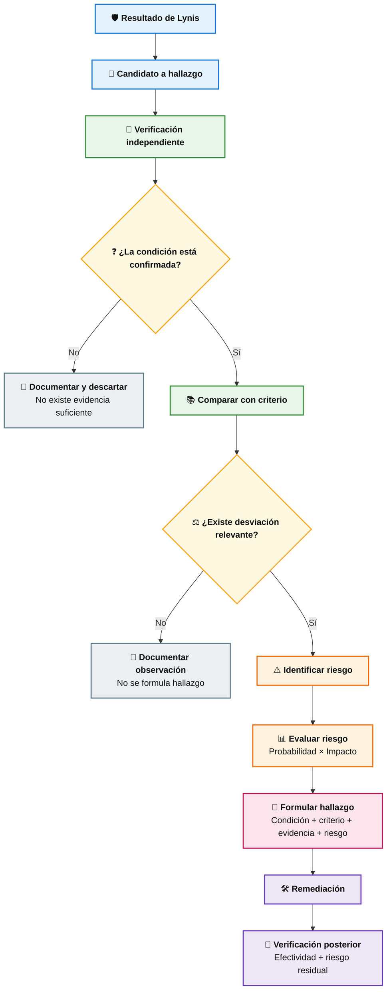

# 🔐 Práctica Guiada: Auditoría de Seguridad de Ubuntu Server con Lynis

## Auditoría de Sistemas de Información

---

## 1. Descripción de la práctica

En esta práctica se realizará una auditoría técnica de seguridad sobre un servidor **Ubuntu Server** utilizando **Lynis**.

El objetivo principal **no consiste únicamente en incrementar el Hardening Index**, sino en utilizar Lynis como herramienta de apoyo para desarrollar el razonamiento propio de una auditoría:

1. Obtener evidencia técnica.
2. Interpretar los resultados.
3. Identificar condiciones que requieren investigación.
4. Verificar independientemente la condición detectada.
5. Comparar la condición contra un criterio.
6. Identificar el riesgo.
7. Evaluar probabilidad e impacto.
8. Determinar si corresponde formular un hallazgo.
9. Proponer e implementar una remediación controlada.
10. Verificar la efectividad del control implementado.

> **Principio de auditoría:** una sugerencia generada por Lynis no constituye automáticamente una vulnerabilidad ni un hallazgo de auditoría.

La secuencia de análisis será:





---

# 2. Objetivos de aprendizaje

Al finalizar la práctica, el estudiante estará en capacidad de:

- Ejecutar una auditoría técnica básica de un servidor Linux mediante Lynis.
- Interpretar correctamente los principales estados reportados por la herramienta.
- Diferenciar entre **resultado técnico, sugerencia, vulnerabilidad, riesgo y hallazgo de auditoría**.
- Obtener evidencia adicional mediante comandos nativos de Linux.
- Analizar una condición técnica utilizando criterios reconocidos.
- Evaluar cualitativamente el riesgo mediante probabilidad e impacto.
- Implementar controles básicos de hardening.
- Verificar la efectividad de las acciones implementadas.
- Comunicar un hallazgo técnico utilizando lenguaje comprensible para la gerencia.

---

# 3. Escenario de auditoría

Para efectos de la práctica se utilizará el siguiente escenario:

> La organización **ACME Financial Services** utiliza el servidor `SRV-LNX-01`, basado en Ubuntu Server, para soportar servicios internos de TI. El servidor contiene información corporativa de uso interno y es administrado remotamente por personal autorizado mediante SSH.
>
> La organización requiere mantener niveles razonables de confidencialidad, integridad, disponibilidad y trazabilidad sobre el servidor. Los accesos administrativos deben estar controlados y las actividades relevantes deben poder ser auditadas.
>
> El equipo de Auditoría de Sistemas ha sido solicitado para realizar una evaluación inicial de seguridad del servidor e identificar oportunidades de fortalecimiento.

---

# 4. Consideraciones iniciales

La máquina virtual utilizada corresponde a una instalación base de Ubuntu Server.

Antes de iniciar la práctica:

- No realizar actualizaciones del sistema.
- No realizar hardening previo.
- No modificar servicios.
- No instalar herramientas adicionales salvo aquellas indicadas expresamente.
- Mantener evidencia de los comandos ejecutados y sus resultados.

> **Importante:** esta configuración se utiliza exclusivamente con fines académicos. No representa una configuración recomendada para un servidor en producción.

---

# 5. Obtención de Lynis

Lynis se utilizará desde su repositorio oficial.

```bash
git clone https://github.com/CISOfy/lynis.git
```

Acceder al directorio:

```bash
cd lynis
```

---

## 5.1 Cambio de propietario

El repositorio fue clonado por un usuario sin privilegios. Antes de ejecutar Lynis como `root`, se cambiará la propiedad del directorio para evitar que código modificable por un usuario normal sea posteriormente ejecutado con privilegios elevados.

Desde el directorio padre:

```bash
cd ..
sudo chown -R root:root lynis
cd lynis
```

Verificar:

```bash
ls -ld .
ls -l include/functions
```

---

# 6. Primera auditoría — Baseline

Ejecutar:

```bash
sudo ./lynis audit system
```

Esta ejecución constituye el:

> **Baseline o estado inicial de seguridad del servidor.**

Registrar al finalizar:

| Indicador | Resultado |
|---|---:|
| Hardening Index | |
| Tests performed | |
| Warnings | |
| Suggestions | |

---

# 7. Interpretación de los resultados

Los estados mostrados por Lynis **no representan automáticamente niveles de riesgo**.

Por ejemplo:

```text
[ ENCONTRADO ]
[ NO ENCONTRADO ]
[ INSEGURO ]
[ SUGERENCIA ]
[ DÉBIL ]
[ PELIGRO ]
```

deben interpretarse dentro del contexto de la prueba correspondiente.

> **No es correcto concluir que `[INSEGURO] = Riesgo Alto` o `[PELIGRO] = Riesgo Crítico` sin realizar un análisis adicional.**

---

# 8. Identificación automática de estados

Utilizar el script proporcionado por el docente para identificar los estados presentes en el resultado de Lynis.

El resultado será similar a:

```text
ESTADO                           CANTIDAD
-----------------------------------------------
OK                                     88
NO ENCONTRADO                          37
INSEGURO                               33
ENCONTRADO                             25
SUGERENCIA                             21
DIFERENTE                              15
HECHO                                  11
NINGUNO                                 9
...
```

> La frecuencia de un estado tampoco representa el número de vulnerabilidades existentes.

Por ejemplo, 33 resultados `[INSEGURO]` **no significan 33 vulnerabilidades críticas**.

---

# 9. Modelo de evaluación del riesgo

Para efectos didácticos se utilizará:

\[
R = P \times I
\]

donde:

- **P = Probabilidad**
- **I = Impacto**
- **R = Nivel de riesgo**

## Probabilidad

| Valor | Nivel | Descripción |
|---:|---|---|
| 1 | Muy baja | El escenario es poco probable dadas las condiciones actuales. |
| 2 | Baja | Puede ocurrir, pero requiere condiciones poco frecuentes. |
| 3 | Media | Existen condiciones razonables para que ocurra. |
| 4 | Alta | Existen condiciones favorables y exposición relevante. |
| 5 | Muy alta | Es altamente probable o existen condiciones de exposición permanente. |

## Impacto

| Valor | Nivel | Descripción |
|---:|---|---|
| 1 | Insignificante | Consecuencias mínimas para el servicio. |
| 2 | Menor | Afectación limitada y fácilmente recuperable. |
| 3 | Moderado | Afectación relevante pero controlable. |
| 4 | Mayor | Afectación significativa al negocio, información o servicio. |
| 5 | Crítico | Consecuencias severas para servicios esenciales, información o cumplimiento. |

## Nivel de riesgo

| Resultado | Nivel |
|---:|---|
| 1–4 | Bajo |
| 5–9 | Medio |
| 10–16 | Alto |
| 17–25 | Crítico |

> Los valores utilizados durante esta práctica corresponden al escenario académico planteado. En una auditoría real deben utilizarse la metodología y criterios de riesgo aprobados por la organización.

---

# 10. Caso guiado 1 — Gestión de antigüedad de contraseñas

## Lynis Control: AUTH-9286

Lynis reporta:

```text
Configure minimum password age in /etc/login.defs [AUTH-9286]
```

## 10.1 ¿Qué significa?

El sistema permite establecer períodos mínimos y máximos para la utilización de las contraseñas.

Una política de antigüedad debe responder a los requisitos y riesgos de la organización.

> La expiración periódica de contraseñas no debe aplicarse mecánicamente como una regla universal. Debe analizarse considerando la política de autenticación, MFA, autenticación centralizada y otros controles existentes.

---

## 10.2 Obtener evidencia

Consultar:

```bash
grep -E '^[[:space:]]*PASS_(MIN_DAYS|MAX_DAYS|WARN_AGE)' /etc/login.defs
```

Consultar posteriormente la cuenta utilizada durante la práctica:

```bash
sudo chage -l netadmin
```

---

## 10.3 Interpretación

`/etc/login.defs` incluye:

```text
PASS_MIN_DAYS
PASS_MAX_DAYS
PASS_WARN_AGE
```

Sin embargo, modificar estos parámetros **no actualiza automáticamente las cuentas existentes**.

Por tanto:

```text
Modificar login.defs
        ≠
Modificar automáticamente netadmin
```

Esta diferencia debe ser verificada por el auditor.

---

## 10.4 Configuración didáctica

Para esta práctica se utilizará:

```text
PASS_MIN_DAYS   1
PASS_MAX_DAYS   90
PASS_WARN_AGE   7
```

> Estos valores corresponden al escenario académico. En producción deben definirse según la política de autenticación y el análisis de riesgo de la organización.

Realizar respaldo:

```bash
sudo cp /etc/login.defs /etc/login.defs.bak
```

Editar:

```bash
sudo nano /etc/login.defs
```

Configurar:

```text
PASS_MIN_DAYS   1
PASS_MAX_DAYS   90
PASS_WARN_AGE   7
```

---

## 10.5 Cuenta existente

Aplicar los valores a `netadmin`:

```bash
sudo chage -m 1 -M 90 -W 7 netadmin
```

Verificar:

```bash
sudo chage -l netadmin
```

---

## 10.6 Ejemplo de análisis gerencial

### Condición

Se identificó que las cuentas locales podían mantener contraseñas durante períodos excesivamente prolongados y no existía un período mínimo definido entre cambios.

### Evidencia

La revisión de `/etc/login.defs` y de la cuenta administrativa mediante `chage` confirmó la configuración de antigüedad existente.

### Riesgo

Una gestión inadecuada del ciclo de vida de las contraseñas puede incrementar el período durante el cual una credencial comprometida continúa siendo válida y puede facilitar prácticas deficientes de administración de credenciales.

### Probabilidad

**3 – Media**

Existen mecanismos de autenticación, pero una credencial comprometida podría permanecer válida durante un período prolongado.

### Impacto

**4 – Mayor**

La cuenta evaluada posee capacidades administrativas sobre el servidor, por lo que su compromiso podría afectar la confidencialidad, integridad y disponibilidad del sistema.

### Riesgo

\[
R = 3 \times 4 = 12
\]

**Nivel: Alto**

### Recomendación gerencial

> Fortalecer la política de gestión de credenciales estableciendo parámetros de vigencia acordes con el nivel de riesgo de las cuentas administrativas y verificando que las políticas definidas sean efectivamente aplicadas a las cuentas existentes.

### Remediación técnica

Se establecieron parámetros de antigüedad en `/etc/login.defs` y se aplicaron a la cuenta administrativa mediante `chage`.

### Evidencia posterior

```bash
sudo chage -l netadmin
```

### Riesgo residual estimado

Probabilidad: **2**

Impacto: **4**

\[
R_r = 2 \times 4 = 8
\]

**Riesgo residual: Medio**

---

# 11. Caso guiado 2 — Banner de advertencia

## Lynis Control: BANN-7130

Lynis reporta:

```text
Add legal banner to /etc/issue.net, to warn unauthorized users [BANN-7130]
```

---

## 11.1 ¿Qué significa?

Un banner previo a la autenticación puede informar que:

- el sistema es de uso autorizado;
- las actividades pueden ser monitoreadas;
- el acceso no autorizado está prohibido.

El contenido debe ser aprobado por la organización y, cuando corresponda, por el área legal.

---

## 11.2 Verificación inicial

```bash
cat /etc/issue.net
```

Verificar además si SSH utiliza un banner:

```bash
sudo sshd -T | grep -i '^banner'
```

---

## 11.3 Configuración

Realizar respaldo:

```bash
sudo cp /etc/issue.net /etc/issue.net.bak
```

Para fines académicos:

```bash
sudo nano /etc/issue.net
```

Contenido de ejemplo:

```text
ADVERTENCIA

Este sistema es propiedad de la organización y su uso está restringido
exclusivamente a personal autorizado.

Las actividades realizadas en este sistema pueden ser monitoreadas y
registradas de acuerdo con las políticas de seguridad vigentes.

El acceso o uso no autorizado puede dar lugar a acciones administrativas
o legales.
```

> En producción, el texto debe ser aprobado por las áreas responsables y no debe revelar información técnica innecesaria sobre el sistema.

---

## 11.4 Configurar OpenSSH

Ubuntu permite utilizar fragmentos de configuración en:

```text
/etc/ssh/sshd_config.d/
```

Crear:

```bash
sudo nano /etc/ssh/sshd_config.d/10-security-banner.conf
```

Agregar:

```text
Banner /etc/issue.net
```

Validar **antes de recargar SSH**:

```bash
sudo sshd -t
```

Si no existen errores:

```bash
sudo systemctl reload ssh
```

Verificar:

```bash
sudo sshd -T | grep -i '^banner'
```

Resultado esperado:

```text
banner /etc/issue.net
```

---

## 11.5 Ejemplo de análisis gerencial

### Condición

El servidor no presentaba una advertencia institucional previa al proceso de autenticación remota.

### Riesgo

La ausencia del banner reduce la capacidad de comunicar explícitamente las condiciones de uso, monitoreo y acceso autorizado establecidas por la organización.

### Probabilidad

**2 – Baja**

La ausencia del banner no facilita directamente el compromiso técnico del servidor.

### Impacto

**2 – Menor**

Su impacto se relaciona principalmente con aspectos de política, advertencia y soporte a procesos administrativos o legales.

### Riesgo

\[
R = 2 \times 2 = 4
\]

**Nivel: Bajo**

### Recomendación gerencial

> Implementar un mensaje institucional previo al acceso remoto que comunique las condiciones de uso autorizado y monitoreo del sistema, previa validación del contenido por las áreas responsables.

### Riesgo residual

\[
R_r = 1 \times 2 = 2
\]

**Riesgo residual: Bajo**

---

# 12. Caso guiado 3 — Hardening SSH

## Lynis Control: SSH-7408

Lynis reporta:

```text
Consider hardening SSH configuration [SSH-7408]

Details:
MaxSessions (set 10 to 2)
```

---

## 12.1 ¿Qué significa?

`MaxSessions` determina cuántas sesiones de shell, login o subsistemas pueden mantenerse dentro de una única conexión SSH.

OpenSSH utiliza por defecto:

```text
MaxSessions 10
```

Lynis propone para este escenario:

```text
MaxSessions 2
```

La configuración debe ajustarse al uso legítimo del servidor.

---

## 12.2 Verificar configuración efectiva

No limitarse a revisar únicamente:

```bash
cat /etc/ssh/sshd_config
```

Utilizar:

```bash
sudo sshd -T | grep -i '^maxsessions'
```

Esto permite consultar la configuración efectiva de `sshd`.

---

## 12.3 Configuración

Crear un archivo específico para hardening:

```bash
sudo nano /etc/ssh/sshd_config.d/20-hardening.conf
```

Agregar:

```text
MaxSessions 2
```

Validar:

```bash
sudo sshd -t
```

> **Nunca reiniciar o recargar SSH sin validar primero la configuración.**

Si la validación es correcta:

```bash
sudo systemctl reload ssh
```

Verificar:

```bash
sudo sshd -T | grep -i '^maxsessions'
```

Resultado esperado:

```text
maxsessions 2
```

---

## 12.4 Ejemplo de análisis gerencial

### Condición

La configuración del servicio de administración remota permitía hasta diez sesiones simultáneas sobre una misma conexión SSH, valor superior al requerido para el escenario definido.

### Riesgo

Una configuración más permisiva de lo necesario incrementa las capacidades disponibles a través del servicio administrativo y se aparta del principio de configuración mínima necesaria.

### Probabilidad

**2 – Baja**

La explotación de esta condición requiere previamente disponer de una conexión SSH autorizada o comprometida.

### Impacto

**3 – Moderado**

En caso de compromiso de credenciales o sesiones administrativas, una configuración excesivamente permisiva podría ampliar las capacidades disponibles al atacante.

### Riesgo

\[
R = 2 \times 3 = 6
\]

**Nivel: Medio**

### Recomendación gerencial

> Ajustar las capacidades del servicio de administración remota al mínimo requerido operacionalmente, reduciendo configuraciones innecesariamente permisivas sin afectar las funciones legítimas de administración.

### Riesgo residual

Probabilidad: **1**

Impacto: **3**

\[
R_r = 1 \times 3 = 3
\]

**Riesgo residual: Bajo**

---

# 13. Caso guiado 4 — Auditoría y trazabilidad

## Lynis Control: ACCT-9628

Lynis reporta:

```text
Enable auditd to collect audit information [ACCT-9628]
```

---

## 13.1 ¿Qué significa?

Linux Audit Framework permite registrar eventos relevantes del sistema.

El componente `auditd` permite conservar registros que posteriormente pueden ser consultados mediante herramientas como:

```text
ausearch
aureport
```

Su ausencia puede limitar la capacidad para:

- investigar incidentes;
- identificar actividades administrativas;
- reconstruir eventos;
- disponer de evidencia técnica;
- monitorear modificaciones relevantes.

---

## 13.2 Verificación inicial

```bash
dpkg -l | grep auditd
```

También:

```bash
systemctl status auditd
```

Si no se encuentra instalado, documentar el resultado como evidencia.

---

## 13.3 Instalación

Este caso requiere instalar un paquete adicional:

```bash
sudo apt update
sudo apt install auditd audispd-plugins
```

> `apt update` actualiza el índice local de paquetes. No equivale a ejecutar una actualización general del sistema mediante `apt upgrade`.

---

## 13.4 Activación

Verificar:

```bash
sudo systemctl status auditd
```

Consultar:

```bash
sudo auditctl -s
```

Verificar registros:

```bash
sudo ls -lh /var/log/audit/
```

---

## 13.5 Prueba sencilla

Consultar eventos recientes:

```bash
sudo ausearch --start recent
```

Generar posteriormente un reporte:

```bash
sudo aureport --summary
```

> Instalar `auditd` constituye únicamente el primer paso. En producción deben definirse reglas de auditoría de acuerdo con los activos, amenazas, requisitos regulatorios y necesidades de monitoreo de la organización.

---

## 13.6 Ejemplo de análisis gerencial

### Condición

El servidor no disponía del servicio de auditoría de Linux habilitado para registrar eventos de seguridad y actividades relevantes del sistema.

### Riesgo

La ausencia de mecanismos adecuados de auditoría puede dificultar la detección, investigación y reconstrucción de actividades no autorizadas o incidentes de seguridad.

### Probabilidad

**3 – Media**

Los eventos administrativos y de seguridad ocurren regularmente, pero sin un mecanismo específico de auditoría parte de la información relevante podría no quedar disponible.

### Impacto

**4 – Mayor**

La pérdida de trazabilidad puede afectar investigaciones de incidentes, atribución de acciones administrativas y capacidad de demostrar el cumplimiento de controles.

### Riesgo

\[
R = 3 \times 4 = 12
\]

**Nivel: Alto**

### Recomendación gerencial

> Implementar capacidades de auditoría y trazabilidad sobre el servidor que permitan registrar, conservar y revisar eventos relevantes de seguridad, estableciendo reglas de monitoreo acordes con la criticidad del sistema.

### Remediación técnica

Instalación y habilitación de Linux Audit Framework mediante `auditd`.

### Riesgo residual estimado

Probabilidad: **2**

Impacto: **4**

\[
R_r = 2 \times 4 = 8
\]

**Riesgo residual: Medio**

> El riesgo no se considera eliminado únicamente por instalar `auditd`; su efectividad depende de las reglas configuradas, monitoreo, protección y retención de los registros.

---

# 14. Segunda auditoría

Después de implementar los cuatro controles:

```bash
cd ~/lynis
sudo ./lynis audit system
```

Registrar nuevamente:

| Indicador | Auditoría inicial | Auditoría final | Diferencia |
|---|---:|---:|---:|
| Hardening Index | | | |
| Tests performed | | | |
| Warnings | | | |
| Suggestions | | | |

---

# 15. Análisis del Hardening Index

Calcular:

\[
\Delta HI = HI_{final} - HI_{inicial}
\]

Ejemplo:

\[
HI_{inicial}=63
\]

\[
HI_{final}=68
\]

entonces:

\[
\Delta HI=68-63=5
\]

La mejora relativa puede expresarse como:

\[
\text{Mejora relativa} =
\frac{HI_{final}-HI_{inicial}}
{HI_{inicial}}
\times100
\]

> **Importante:** un incremento del Hardening Index no demuestra por sí mismo que el servidor sea seguro.

Por tanto:

\[
\Delta HI > 0
\not\Rightarrow
\text{Sistema completamente seguro}
\]

---

# 16. Comparación de los cuatro casos

| Control Lynis | Condición | P | I | Riesgo inicial | Riesgo residual |
|---|---|---:|---:|---:|---:|
| AUTH-9286 | Gestión de antigüedad de contraseñas | 3 | 4 | 12 - Alto | 8 - Medio |
| BANN-7130 | Banner de advertencia ausente | 2 | 2 | 4 - Bajo | 2 - Bajo |
| SSH-7408 | Configuración SSH permisiva | 2 | 3 | 6 - Medio | 3 - Bajo |
| ACCT-9628 | Auditoría del sistema no habilitada | 3 | 4 | 12 - Alto | 8 - Medio |

> Los valores anteriores constituyen una valoración didáctica basada en el escenario de esta práctica. El estudiante debe comprender que la criticidad no procede directamente de Lynis.

---

# 17. Preguntas de discusión

### Pregunta 1

Si Lynis genera una sugerencia, ¿significa automáticamente que existe una vulnerabilidad?

### Pregunta 2

¿Por qué `BANN-7130` puede tener una prioridad menor que `ACCT-9628` aunque ambos aparezcan como `Suggestion`?

### Pregunta 3

¿Un Hardening Index más alto demuestra que el servidor es seguro?

### Pregunta 4

¿Por qué el auditor debe verificar independientemente una condición reportada por una herramienta automatizada?

### Pregunta 5

¿Qué diferencia existe entre:

```text
Resultado técnico
Vulnerabilidad
Riesgo
Hallazgo
Recomendación
```

### Pregunta 6

¿Por qué instalar `auditd` no garantiza por sí mismo una adecuada trazabilidad?

### Pregunta 7

¿Qué podría ocurrir si se modifica incorrectamente SSH y se reinicia el servicio sin validar previamente la configuración?

---

# 18. Modelo general para documentar un hallazgo

Los siguientes elementos deberán utilizarse posteriormente para analizar los resultados de una auditoría:

## H-XX — Nombre del hallazgo

### 1. Resultado de la herramienta

```text
ID Lynis:
Resultado:
```

### 2. Condición

¿Qué situación fue identificada?

### 3. Evidencia

¿Qué evidencia independiente confirma la condición?

```bash
<comando utilizado>
```

### 4. Criterio

¿Qué política, estándar, benchmark o documentación establece el estado esperado?

### 5. Riesgo

¿Qué podría ocurrir si la condición permanece?

### 6. Probabilidad

Valor:

Justificación:

### 7. Impacto

Valor:

Justificación:

### 8. Nivel de riesgo

\[
R=P\times I
\]

### 9. Conclusión del auditor

¿La condición constituye un hallazgo?

```text
Sí / No
```

Justificación:

### 10. Recomendación gerencial

Explicar qué debería hacer la organización sin limitarse a proporcionar comandos técnicos.

### 11. Remediación técnica

Indicar, cuando corresponda, las acciones técnicas necesarias.

### 12. Evidencia posterior

Demostrar que el control fue implementado.

### 13. Riesgo residual

\[
R_r=P_r\times I_r
\]

---

# 19. Fuentes recomendadas para investigación

La investigación de una recomendación de Lynis debe seguir preferentemente la siguiente jerarquía:

1. **Documentación oficial del sistema operativo.**
2. **Manual oficial de la herramienta o servicio (`man`).**
3. **Benchmark de seguridad reconocido.**
4. **Documentación del control Lynis.**
5. **Fuentes técnicas secundarias confiables.**

Ejemplos locales:

```bash
man login.defs
man chage
man sshd_config
man auditd
man auditctl
```

## Recursos

- Lynis:
  https://cisofy.com/lynis/

- Lynis AUTH-9286:
  https://cisofy.com/lynis/controls/AUTH-9286/

- Lynis BANN-7130:
  https://cisofy.com/lynis/controls/BANN-7130/

- Lynis SSH-7408:
  https://cisofy.com/lynis/controls/SSH-7408/

- Lynis ACCT-9628:
  https://cisofy.com/lynis/controls/ACCT-9628/

- Ubuntu Server Documentation:
  https://documentation.ubuntu.com/server/

- CIS Ubuntu Linux Benchmark:
  https://www.cisecurity.org/benchmark/ubuntu_linux

---

# 20. Conclusiones esperadas

Al finalizar la práctica, el estudiante deberá comprender que:

1. **Lynis es una herramienta de apoyo y no sustituye el juicio profesional del auditor.**

2. Una sugerencia de Lynis constituye inicialmente un elemento que debe ser investigado:

\[
\text{Suggestion}
\rightarrow
\text{Investigación}
\rightarrow
\text{Evidencia}
\rightarrow
\text{Criterio}
\rightarrow
\text{Riesgo}
\]

3. Dos sugerencias de Lynis pueden representar niveles de riesgo completamente diferentes.

4. La criticidad debe determinarse considerando:

\[
\text{Activo}
+
\text{Amenaza}
+
\text{Condición}
+
\text{Controles}
+
\text{Contexto organizacional}
\]

5. La implementación de un control debe ser verificada mediante evidencia.

6. Una remediación puede reducir el riesgo, pero no necesariamente eliminarlo.

7. El Hardening Index constituye un indicador técnico útil para comparar el estado del sistema, pero no debe interpretarse como una certificación de seguridad.

---

## Principio final de la práctica

> **El auditor no debe limitarse a informar lo que una herramienta encontró. Su responsabilidad consiste en interpretar la evidencia, comprender su relevancia para el negocio, evaluar el riesgo y comunicar conclusiones que permitan tomar decisiones informadas.**
